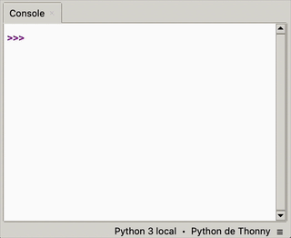

# Jeu du morpion

## Introduction

Ces travaux pratiques consistent à créer un jeu de morpion en complétant différentes fonctions.
Le fichier de base contient déjà la structure du programme ainsi que différentes fonctions d'affichage du plateau.
L'objectif est que vous puissiez travailler sur l'essentiel, à savoir la maîtrise des tableaux et des tuples.

<figure markdown>
{:style="border:1px solid black;"}    
</figure>

## Préparation

### Espace de travail

Vous allez créer des dossiers afin de ne pas mélanger vos productions numériques entre vos différentes matières et
travaux pratiques.

!!! note "Organisation de l'espace travail"

    === ":material-laptop: Ordinateur portable"

        1. Lancez l'application <i class="icon file-explorer"></i> **Explorateur de fichiers** 
           <span class="keys shortcut"><kbd>:fontawesome-brands-windows:</kbd><span>+</span><kbd>E</kbd></span>
        2. Dans le dossier `Documents`, s'il n'y a pas de dossier nommé `NSI`, créez-le
        3. Dans le dossier `NSI`, s'il n'y a pas de dossier `chapitre_06`, créez-le
        4. Dans le dossier `chapitre_06` créez le dossier `tp3_morpion`

    === ":material-desktop-tower: Ordinateur fixe"

        1. Depuis le bureau, double-cliquez sur l'icône intitulée **Zone personnelle**
        2. Dans la **zone personnelle**, s'il n'y a pas de dossier `NSI`, créez-le
        3. Dans le dossier `NSI`, s'il n'y a pas de dossier `chapitre_06`, créez-le
        4. Dans le dossier `chapitre_06` créez le dossier `tp3_morpion`

### Téléchargement

Pour réaliser ces travaux pratiques, il est nécessaire de disposer de certains fichiers.

!!! note "Récupération des fichiers"

    1. Téléchargez le fichier ZIP contenant les fichiers nécessaires : [:material-download: télécharger](assets/NSI1RE06_TP3_morpion.zip){:download="NSI1RE06_TP3_morpion.zip"}
    2. Ouvrez le fichier ZIP<br>*(si le navigateur ne l'ouvre pas automatiquement, cliquez sur le fichier téléchargé)*
    3. Sélectionnez tous les fichiers et dossiers  <span class="shortcut">++ctrl+a++</span>
    4. Copiez tous les fichiers et dossiers <span class="shortcut">++ctrl+c++</span>
    5. Collez les fichiers dans le dossier `NSI\chapitre_06\tp3_morpion` <span class="shortcut">++ctrl+v++</span>

## Implémentation

### Partie 1 - Initialisation du plateau

!!! info "Instructions"
    1. Implémentez la fonction `#!python generer_plateau()` qui doit créer un tableau 3×3 rempli de zéros
    2. Implémentez la fonction `#!python case_plateau(valeur)` qui convertit :
        - L'entier `#!python 0` en `#!python " "` (espace)
        - L'entier `#!python 1` en `#!python "X"`
        - L'entier `#!python 2` en `#!python "O"`

!!! help "aide"
    Pour créer un tableau à deux dimensions, vous pouvez utiliser des tableaux en comprehension ou la méthode `append()` *(hors programme)* :

    ```python
    # Méthode 1 - Tableau en compréhension
    t = [ ... for _ in range(...)]
    
    # Méthode 2 - Ajout d'éléments à un tableau avec append()
    t = []
    for _ in range(...):
        t.append(...)
    ```

### Partie 2 - Gestion des coups

!!! info "Instructions"
    1. Implémentez `#!python traiter_saisie_joueur(saisie)` qui convertit une saisie `#!python "12"` en coordonnées `#!python (0,1)`
        - Le premier chiffre correspond à la ligne *(valeur comprise entre 1 et 3)*
        - Le second chiffre correspond à la colonne *(valeur comprise entre 1 et 3)*
        - Renvoyez un tuple avec les coordonnées dans le tableau Python *(ligne-1, colonne-1) car indexé à partir de 0*
    2. Complétez `#!python jouer_coup_joueur(plateau, joueur, coup)` qui place le numéro du joueur dans la case correspondante

!!! example "Exemple"
    ```python
    # Si le joueur saisit "13"
    joueur = 1
    coup = traiter_saisie_joueur("13")  # Renvoie (0,2)
    jouer_coup_joueur(plateau, joueur, coup) # Place un 1 en position plateau[0][2]
    ```

### Partie 3 - Conditions de fin de partie

!!! info "Instructions"
    1. Implémentez `tester_victoire(plateau, joueur)` qui vérifie :
        - Les lignes
        - Les colonnes
        - Les deux diagonales
    2. Implémentez `tester_match_nul(plateau)` qui vérifie si toutes les cases sont occupées

### Partie 4 - Logique du jeu

!!! info "Instructions"

    Implémenter la fonction `lancer_jeu()` dont voici la logique en pseudo-code :

    ```
    DÉBUT
        plateau ← générer un plateau vide
        joueur ← 1
        victoire ← faux
        match_nul ← faux
    
        TANT QUE pas de victoire et pas de match_nul FAIRE
            afficher le plateau
            demander et récupérer le coup du joueur
            jouer le coup sur le plateau
            
            SI le joueur a gagné ALORS
                victoire ← vrai
            SINON SI match nul ALORS
                match_nul ← vrai
            SINON
                changer de joueur
            FIN SI
        FIN TANT QUE

        afficher le plateau

        SI victoire ALORS
            afficher message de victoire
        SINON
            afficher message de match nul
        FIN SI
    FIN
    ```

### Partie 5 - Validation des entrées 

!!! info "Instructions"
    1. Modifiez `jouer_coup_joueur()` pour vérifier avant de jouer que :
        - Les coordonnées sont dans le plateau *(entre 0 et 2)*
        - La case est libre *(contient 0)*
    2. Faites en sorte de redemander une saisie au joueur tant que son coup n'est pas valide

### Améliorations

!!! info "Instructions"
    Essayez maintenant d'implémenter toutes les améliorations que vous jugeriez utiles, comme par exemple :

    - Ajouter un menu pour recommencer une partie
    - Implémenter un système de score
    - Ajouter des couleurs avec le module [:material-link: colorama](https://github.com/tartley/colorama){:target="_blank"} ou [:material-link: rich](https://github.com/Textualize/rich){:target="_blank"}

