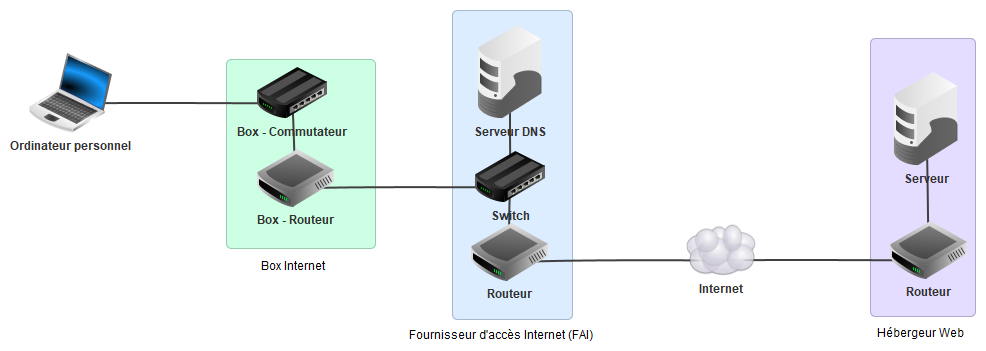
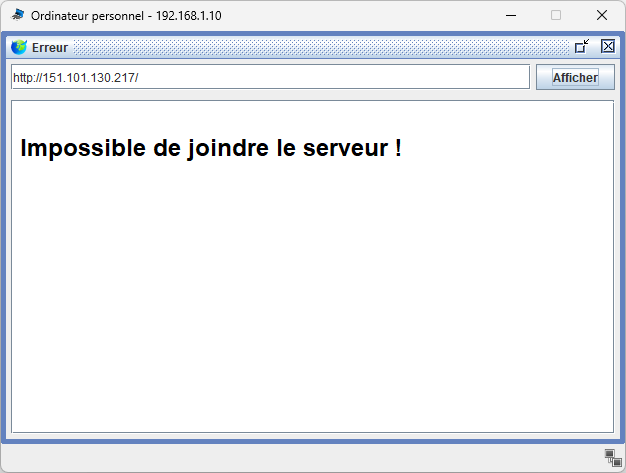
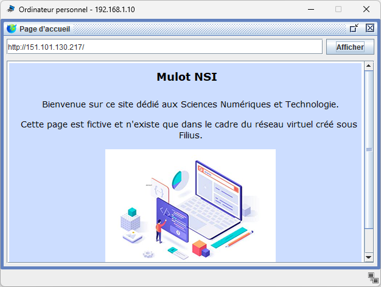
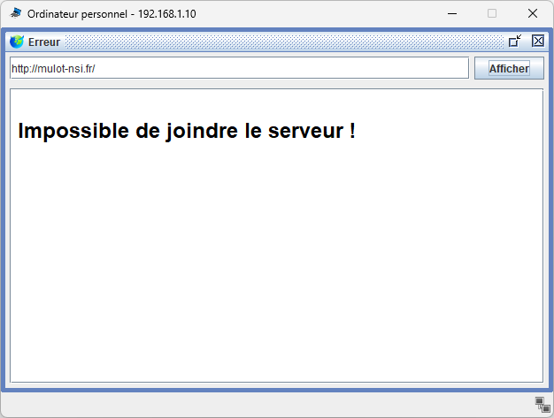
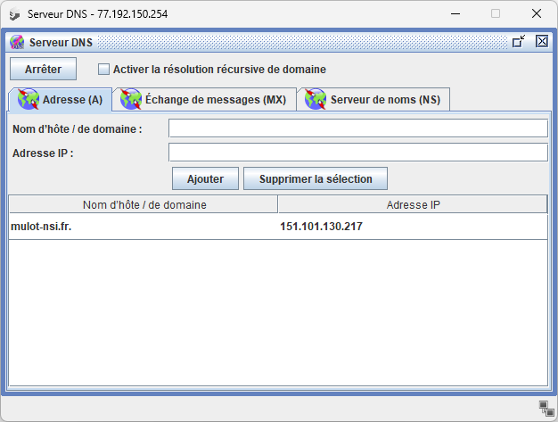
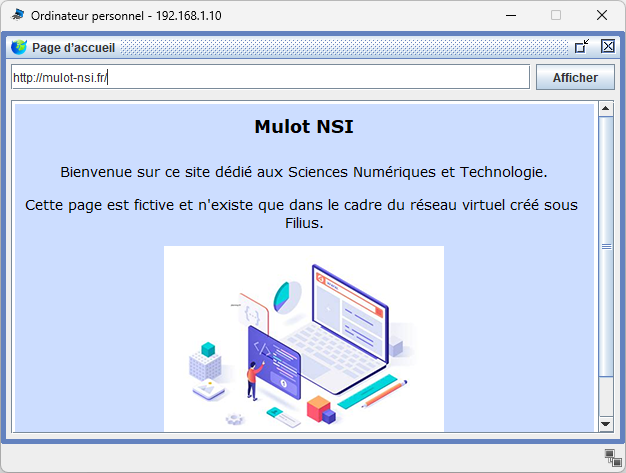

# Serveur DNS

## Introduction

Nous avons vu que toute machine connectée au réseau Internet dispose d'une adresse IP.
Cependant, au quotidien, les adresses IP sont difficiles à mémoriser, tout comme il vous est difficile de mémoriser les numéros de téléphone de tous vos contacts.

Pour y remédier, il existe un service appelé DNS *(Domain Name System)*. 
Il permet de traduire à savoir une **adresse symbolique** comme `lemonde.fr` (aussi appelée **nom de domaine**), en une adresse IP utilisable par les machines pour communiquer.

!!! danger "Attention"

    Ces travaux pratiques sont **notés**. Assurez-vous de **tout lire** et **bien comprendre** chaque concept présenté afin d'être en mesure de répondre dans de bonnes conditions au QCM d'évaluation.

## Préparation

<h3>Création du dossier de travail</h3>

Vous allez créer des dossiers afin de ne pas mélanger vos productions numériques entre vos différentes matières et
travaux pratiques.

!!! danger "Attention"

    Soyez attentif aux onglets de bloc *Organisation de l'espace de travail* ci-après. L'organisation de votre espace de travail dépend de l'ordinateur que vous utilisez :
    
    - **:material-laptop: Ordinateur portable** : ordinateur Y13 distribué par la région
    - **:material-desktop-tower: Ordinateur fixe** : ordinateur fixe du lycée

!!! note "Organisation de l'espace de travail"

    === ":material-laptop: Ordinateur portable"

        1. Lancez l'application <i class="icon file-explorer"></i> **Explorateur de fichiers** 
           <span class="keys shortcut"><kbd>:fontawesome-brands-windows:</kbd><span>+</span><kbd>E</kbd></span>
        2. Dans le dossier `Document`, s'il n'y a pas de dossier nommé `SNT`, créez-le
        3. Dans le dossier `SNT`, s'il n'y a pas de dossier `internet`, créez-le

    === ":material-desktop-tower: Ordinateur fixe"

        1. Depuis le bureau, double-cliquez sur l'icône intitulée **Zone personnelle**
        2. Dans la **zone personnelle**, s'il n'y a pas de dossier nommé `SNT`, créez-le
        3. Dans le dossier `SNT`, s'il n'y a pas de dossier `internet`, créez-le

<h3>Téléchargement</h3>

Dans le cadre de ces travaux pratiques, vous allez travailler sur un réseau Filius existant que vous devez télécharger.

!!! note "Récupération du fichier"

    1. Téléchargez le fichier Filius : [:material-download: télécharger](assets/reseau_dns.fls){:download="reseau_dns.fls"}
    2. Retournez dans l'application <i class="icon file-explorer"></i> **Explorateur de fichiers**
    3. Déplacez le fichier `reseau_dns.fls` téléchargé dans le dossier `SNT\internet` en faisant un *couper/coller* (à la place d'un *copier/coller*) :
        - **Coupez** le fichier `reseau_dns.fls` <span class="shortcut">++ctrl+x++</span>
        - Collez le fichier dans le dossier `SNT\internet` <span class="shortcut">++ctrl+v++</span>

## Activités

Le réseau Filius représente un réseau domestique connecté à Internet à l'aide d'une **Box Internet**.
Cet appareil multifonction fait office de **commutateur** (ou switch, afin d'y connecter une ou plusieurs machines via Ethernet ou WIFI) et de **routeur** (afin de relier le réseau local de votre maison au réseau Internet).

On y voit également le réseau très simplifié du **Fournisseur d'Accès à Internet** (FAI) qui vous ouvre l'accès au réseau Internet.
Est aussi visible le réseau d'un **hébergeur web**, disposant d'un **serveur** sur lequel se trouve un ou plusieurs sites web.

<figure markdown>
  
</figure>

### 1. Connecter un ordinateur

Pour cette première étape, vous allez connecter un nouvel ordinateur à la Box en le configurant correctement.

!!! note "Configuration de l'ordinateur"

    1. Lancez l'application **Filius** (en prenant soin de bien choisir la langue **Française** au démarrage)
    2. Ouvrez le fichier `reseau_dns.fls` téléchargé en étape préparatoire
    3. Connectez l'**ordinateur personnel** à la Box Internet à l'aide d'un cable ethernet
    4. Attribuez l'adresse IP `192.168.1.10` à l'ordinateur personnel
    5. Configurez la **passerelle** de l'ordinateur personnel en lui attribuant l'adresse IP de la Box Internet : `192.168.1.1`

!!! info "Qu'est-ce que la passerelle ?"

    Pour rappel, la **passerelle** permet de spécifier la machine à qui envoyer les paquets si le destinataire ne fait pas partie de votre réseau.
    
    Ainsi, si vous cherchez à communiquer avec une machine qui n'est pas connectée à votre Box Internet, vous chargez cette dernière de la trouver sur le réseau Internet.


### 2. Tester la connectivité

Votre ordinateur est connecté à la Box Internet. Vous allez maintenant vérifier s'il a bien accès à Internet.
Pour cela, vous allez effectuer un test de connectivité vers le serveur de l'hébergeur web.

!!! note "Vérification de l'accès à Internet"

    1. Lancez la simulation en cliquant le bouton **lecture** (le triangle vert)
    2. Connectez-vous à l'**ordinateur personnel**
    3. Installez l'application **Ligne de commande**
    4. Testez la connectivité en effectuant un `ping` vers le serveur de l'hébergeur web d'adresse IP `151.101.130.217`

??? success "Résultat attendu"

    En lançant la commande `ping`, vous devez obtenir un affichage comparable à celui-ci :

    ``` hl_lines="7 7"
    PING 151.101.130.217 (151.101.130.217)
    From 151.101.130.217 (151.101.130.217): icmp_seq=1 ttl=61 time=2547ms
    From 151.101.130.217 (151.101.130.217): icmp_seq=2 ttl=61 time=829ms
    From 151.101.130.217 (151.101.130.217): icmp_seq=3 ttl=61 time=849ms
    From 151.101.130.217 (151.101.130.217): icmp_seq=4 ttl=61 time=843ms
    --- 151.101.130.217 Statistiques des paquets ---
    4 paquets transmis, 4 paquets reçus, 0% paquets perdus
    ```

Allons plus loin en vérifiant le chemin pris par les paquets échangés entre l'ordinateur personnel et le serveur.
Pour cela, vous allez utiliser la commande `traceroute`.

!!! note "Vérification du chemin des paquets"

    1. Lancez la simulation
    2. Connectez vous à l'**ordinateur personnel**
    3. Lancez l'application **Ligne de commande**
    4. Effectuez un `traceroute` vers le serveur de l'hébergeur web d'adresse IP `151.101.130.217`
    5. Plusieurs adresses IP sont visibles, à quoi correspondent les adresses 1, 2 et 3 ?

??? success "Résultat attendu"

    En lançant la commande `traceroute`, vous devez obtenir un affichage comparable à celui ci-dessous. 
    À vous de trouver à quel type d'appareil correspondent les adresses IP 1, 2 et 3 en les retrouvant parmi les appareils du réseau.

    ```
    Etablissement de la connexion avec 151.101.130.217 (en 20 sauts max.).
     1 192.168.1.1 
     2 77.192.150.1
     3 9.9.9.30
     4 151.101.130.217
    ```


### 3. Consulter un site web

#### Navigation sur le Web

Maintenant que l'ordinateur personnel est connecté à Internet, vous allez consulter un site web.
L'hébergeur web dispose d'un serveur abritant un site web auquel vous allez tenter d'accéder.

!!! note "Accès au site web"

    1. Lancez la simulation
    2. Connectez vous à l'**ordinateur personnel**
    3. Installez l'application **Navigateur web** et lancez-la
    4. Saisissez l'url `http://151.101.130.217` (sans le *s* à *http*)
    5. Cliquez sur **Afficher** et observez le résultat. Une erreur doit se produire.

??? success "Résultat attendu"

    Une page d'erreur s'affiche malgré le fait que le serveur soit bien connecté au réseau Internet
    et qu'un site web soit bien présent sur celui-ci.

    <figure markdown>
      
    </figure>


#### Vérification du serveur web

Vous êtes désormais en charge de l'administration d'un serveur web. 
Vous allez vous connecter au serveur de l'hébergeur web afin d'en vérifier le bon fonctionnement :

!!! note "Administration du serveur web"

    <h5>Depuis le serveur web</h5>

    1. Lancez la simulation
    2. Connectez-vous à la machime **Serveur** de l'**hébergeur web**
    3. Vérifiez que le logiciel **Serveur web** soit bien installé
    4. Cliquez sur l'icône de ce logiciel 
    5. Si celui-ci est arrêté, cliquez sur le bouton **Démarrer**

    <h5>Depuis l'ordinateur personnel</h5>

    1. Connectez-vous ensuite à l'**ordinateur personnel**
    2. Lancez le **Navigateur web**
    3. Saisissez l'url `http://151.101.130.217` et appuyez sur **Afficher**
    4. Observez le résultat

??? success "Résultat attendu"

    Cette fois, la page d'accueil d'un site intitulé Mulot NSI doit apparaître.
    Vous devez comprendre qu'un **serveur web** est un **logiciel** installé et fonctionnant sur une machine elle-même appelée serveur.
    Cette machine stocke les pages web et les transmet à toute machine qui les lui demanderait via le protocole HTTP *(prochain chapitre de cette année)*.

    <figure markdown>
      
    </figure>


### 4. Configurer le DNS

#### Configuration de l'ordinateur personnel

Le **DNS** pour **Domain Name System** est un service permettant de traduire une adresse symbolique (ou nom de domaine) telle que `mulot-nsi.fr` en une adresse IP.

!!! info "Le serveur DNS"

    Le serveur DNS est un ordinateur capable de fournir le service DNS. Il en existe un chez votre Fournisseur d'Accès à Internet (FAI).
    En vous connectant par le WIFI ou un câble ethernet à votre Box, celle-ci indique automatiquement à votre appareil l'adresse IP du serveur DNS (via un protocole appelé **DHCP**).
    
    Vous avez la possibilité de choisir un serveur DNS autre que celui de votre FAI, tel que [:material-link: DNS0.EU](https://www.dns0.eu/fr){:target="_blank"}, en modifiant les paramètres réseau de votre appareil.            

    Dans le cadre de notre réseau virtuel, la configuration du DNS n'est pas automatique et devra se faire manuellement.

!!! note "Configuration de l'ordinateur personnel"

    1. Quittez la simulation
    2. Consultez la configuration réseau de l'**ordinateur personnel**
    3. Complétez le paramètre réseau **Serveur DNS** de l'ordinateur portable avec l'adresse IP sur serveur DNS du FAI : `77.192.150.254`    
    4. Lancez la simulation
    5. Connectez-vous à l'**ordinateur personnel**
    5. Lancez le logiciel **Navigateur web** et accédez à l'url `http://mulot-nsi.fr` 
    6. Observez le résultat, une erreur devrait encore se produire.

??? success "Résultat attendu"

    L'adresse est inaccessible.
    Nous allons maintenant vérifier la configuration du serveur DNS en nous connectant directement à ce dernier.

    <figure markdown>
      
    </figure>


#### Configuration du serveur DNS

Vous voilà désormais en charge de la gestion d'un serveur DNS. Connectez-vous au serveur DNS pour corriger sa configuration.

!!! note "Configuration du serveur DNS"

    <h5>Le logiciel Serveur DNS</h5>

    1. Lancez la simulation
    2. Connectez-vous au **serveur DNS** du Fournisseur d'Accès à Internet (FAI)
    3. Lancez le logiciel **Serveur DNS**
    
    !!! info "Important" 
    
        Le DNS est aussi un **logiciel informatique** installé sur une machine. Celui-ci ne comporte actuellement aucune référence au nom de domaine `mulot-nsi.fr`.
    
    <h5>Configuration du DNS</h5>

    1. Saisissez `mulot-nsi.fr` dans le champ **Nom d'hôte / de domaine**
    2. Saisissez l'adresse IP du serveur web `151.101.130.217` dans le champ **Adresse IP** 
    3. Cliquez sur le bouton **Ajouter**
    4. Assurez-vous que le serveur DNS soit bien actif

??? success "Résultat attendu"

    L'association entre le nom de domaine `mulot-nsi.fr` et l'adresse IP `151.101.130.217` a été ajoutée au serveur DNS.
    C'est un peu comme si vous aviez ajouté un contact à votre téléphone en associant son nom à son numéro de téléphone.
    Il vous est ainsi possible de le contacter directement par son nom.

    <figure markdown>
      
    </figure>

Vous allez maintenant vérifier le bon fonctionnement de la configuration DNS en vous rendant à l'adresse `http://mulot-nsi.fr` depuis l'ordinateur personnel.

!!! note "Vérification via le navigateur web"
    
    1. Lancez la simulation
    2. Connectez-vous à l'**ordinateur personnel**
    3. Lancez le logiciel **Navigateur web**
    4. Saisissez l'url `http://mulot-nsi.fr` et cliquez sur **afficher** 
    5. Observez le résultat, la page web d'accueil du site doit apparaître

??? success "Résultat attendu"

    <figure markdown>
      
    </figure>

### 5. Vérifier le DNS

Pour tester directement un serveur DNS, il est possible d'utiliser la commande `nslookup`. Celle-ci permet de faire une **résolution DSN**, c'est-à-dire trouver l'adresse IP à partir d'un nom de domaine.

!!! note "Utilisation de la commande `nslookup`"

    === ":material-laptop: Ordinateur portable"

        1. Lancez la simulation
        2. Connectez-vous à l'**ordinateur personnel**
        3. Lancez le logiciel **Ligne de commande**
        4. Effectuez un `nslookup` avec comme paramètre le domaine `mulot-nsi.fr`

    === ":material-desktop-tower: Ordinateur fixe"

        La verion de Filius du lycée ne dispose pas de la commande `nslookup` à la place, vous aller lancer cette commande **réellement**.

        1. Lancez l'application `cmd` de Windows
        2. Effectuez un `nslookup` avec comme paramètre le domaine `mulot-nsi.fr`


??? success "Résultat attendu"

    === ":material-laptop: Ordinateur portable"

        La commande `nslookup` a permis d'interroger le serveur DNS et ainsi obtenir l'adresse IP du domaine `mulot-nsi.fr`
        Vous trouverez indiqués l'adresse IP du serveur DNS `77.192.150.254` interrogé et l'adresse IP du serveur web `151.101.130.217`.
        
        ``` hl_lines="7 7"
        /> nslookup mulot-nsi.fr
        Server: 77.192.150.254
        Address: 77.192.150.254
        
        Non-authoritative Answer:
        Name: mulot-nsi.fr.
        Address: 151.101.130.217
        ```
    
    === ":material-desktop-tower: Ordinateur fixe"
    
        La commande `nslookup` a permis d'interroger le serveur DNS du lycée et ainsi obtenir la vraie adresse IP du domaine `mulot-nsi.fr`
        Vous trouverez indiqués l'adresse IP du serveur DNS `77.192.150.254` interrogé et l'adresse IP du serveur web `151.101.130.217`.
        
        ``` hl_lines="7 7"
        /> nslookup mulot-nsi.fr
        Server: BACHELARD-SRV1.bachelard.local
        Address: 172.16.100.5
        
        Réponse ne faisant pas autorité:
        Name: mulot-nsi.fr
        Address: 76.76.21.21
        ```


## Évaluation

Afin de vérifier votre compréhension de ces travaux pratiques, veuillez répondre au questionnaire Pronote suivant :

!!! note "Questionnaire de vérification"

    1. Connectez-vous à l'**ENT** : [:material-link: https://monlycee.net](https://monlycee.net){:target="_blank"}
    2. Accédez à l'application **Pronote**
    3. Depuis l'accueil, recherchez le QCM intitulé **SNT01 TP - Serveur DNS**
    4. Cliquez sur le bouton 
       **Exécuter le QCM**{:style="display:inline-block;color:#4a1b7f;background-color:#ebdbff;padding:5px 20px;border-radius:10px;"}


## Bonus

<h3>Modification de la page HTML</h3>

Vous avez la possibilité de modifier le contenu du site web présent dans la simulation :

!!! note "Modification du site web"
    
    1. Lancez la simulation
    2. Connectez-vous au **Serveur** de l'hébergeur web
    3. Lancez le logiciel **Éditeur de textes**
    4. Ouvrez le fichier `webserver/index.html`
    5. Modifiez le contenu écrit en langage HTML et observez le résultat depuis le navigateur de l'ordinateur personnel

<h3>Activités ludiques</h3>

Exercez-vous à la programmation :

- Programmation Python sur [:material-link: Pyrates](https://py-rates.fr/){:target="_blank"}
- Exécution d'algorithmes sur [:material-link: Compute-it](https://compute-it.toxicode.fr/){:target="_blank"}