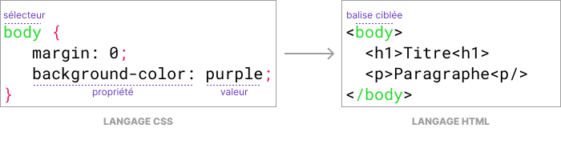
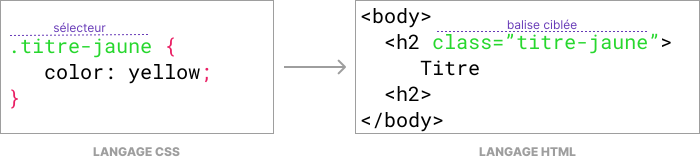

# Le langage CSS avec Capytale

## Introduction

Le CSS *(Cascading Style Sheets)* est un langage qui permet de **contrôler l'apparence**
des éléments d'une page web (couleurs, tailles, positions...).
C'est un langage très différent du HTML que vous connaissez déjà.
Vous allez apprendre à l'utiliser dans l'environnement **Capytale**.

## Préparation

### Accès à Capytale

Vous allez utiliser l'environnement Capytale accessible depuis l'ENT. Pour cela, suivez les instructions suivantes :

!!! note "Instructions"

    1. Connectez-vous à l'activité Capytale : [:material-link: https://capytale2.ac-paris.fr/web/c/084f-4404390](https://capytale2.ac-paris.fr/web/c/084f-4404390){:target="_blank"}
    2. Choisissez de vous connecter à **Monlycée.net (Île-de-France)**
    3. Si demandé, saisissez votre identifiant et votre mot de passe de l'ENT
    4. Cliquez sur **Go !**

### L'espace de travail

L'écran de votre ordinateur est relativement petit, ce qui rend l'espace de travail peu ergonomique.
Pour faciliter les choses, vous allez masquer certains éléments en suivant les instructions ou en visualisant la vidéo
ci-dessous.

!!! note "Instructions"

    1. Masquez la consigne en cliquant sur l'icône double-flèche
    2. Masquez la liste des fichiers, vous n'aurez pas à les manipuler
    3. Ouvrez le fichier `style.css` en cliquant sur l'onglet correspondant

    ---

    <div style="position: relative; padding-top: 56.25%;"><iframe title="SNT02 Web - Le langage CSS avec Capytale" width="100%" height="100%" src="https://tube-sciences-technologies.apps.education.fr/videos/embed/8f838959-9489-4ed4-8c74-c9f32740cc75?title=0&amp;warningTitle=0&amp;peertubeLink=0&amp;p2p=0" frameborder="0" allowfullscreen="" sandbox="allow-same-origin allow-scripts allow-popups allow-forms" style="position: absolute; inset: 0px;"></iframe></div>

## Définition des styles

### Changement de couleur

Le fichier `index.html` correspond à la page web à mettre en forme.
L'ensemble des règles de mise en forme CSS sont écrites dans le fichier `style.css`.
Ce fichier est appelé **feuille de style**.

Pour commencer à styliser la page web, vous allez changer sa couleur de fond :

!!! note "Instructions"

    1. Si ce n'est pas déjà fait, ouvrez le fichier `style.css` en cliquant sur l'onglet correspondant
    2. Copiez et collez le code suivant :

        ```css
        body {
          background-color: red;
        }
        ```
    3. Observez le changement dans la zone de prévisualisation à droite

Pour choisir votre couleur, vous avez deux possibilités :

- Utilisez un **nom de couleur** en anglais comme `DarkSeaGreen`<br>
  *(découvrez une liste de couleurs disponibles sur [:material-link: Wikipedia](https://en.wikipedia.org/wiki/web_colors){:target="_blank"})*
- Utilisez un **code couleur** comme `#ff3870`<br>
  *(que vous pouvez obtenir grâce au sélecteur de couleur [:material-link: Google](https://www.google.com/search?q=color+picker){:target="_blank"})*

!!! note "Instructions"

    1. Modifiez la couleur de la page en remplaçant `red` par un autre **nom de couleur**
    2. Modifiez la couleur de la page en remplaçant le nom de couleur par un **code couleur**

### Changement de taille

Le visuel de l'affiche est beaucoup trop grand et nous souhaitons réduire sa taille.
Le langage CSS offre la possibilité de modifier les dimensions des éléments de la page.
Les images sont définies en HTML grâce à la balise `#!html `. C'est celle-ci que nous allons cibler en CSS.

!!! note "Instructions"

    1. Ouvrez le fichier `style.css` en cliquant sur l'onglet correspondant
    2. Ajoutez la déclaration de style suivante à la feuille de style :

        ```css
        img {
          width: 100px;
        }
        ```
    3. Observez le changement dans la zone de prévisualisation à droite

??? success "Solution"

    Le code CSS du fichier `style.css` devrait être comparable à celui-ci :

    ```css
    body {
      background-color: #FFFF66;
    }
    
    img {
      width: 100px;
    }
    ```

### Sélecteur de type

Nous allons étudier plus en détail la feuille de style `style.css` afin comprendre les principes et la syntaxe du
langage CSS.

!!! tip "Cours - Le langage CSS"

    Une feuille de styles contient un ensemble de **déclarations**. Chaque déclaration est constituée de deux parties :

    - Un **sélecteur**, qui permet de sélectionner la **balise** de l'élément à mettre en forme
    - Un ensemble de **règles** entre accolades `{ }`. Les règles permettent d'ajuster la **valeur** des **propriétés** de mise en forme

    <figure markdown>
        
        <figcaption>Exemple de déclaration CSS ciblant la balise </em><code>body</code></figcaption>
    </figure>

    Dans le cas ci-dessus, il est question du **sélecteur** `body`.
    Il s'agit d'un **sélecteur de type**, c'est-à-dire qu'il permet de cibler la balise de type `<body>` qui se verra alors appliquer l'ensemble des règles définies (marge à 0 et couleur de fond violet).

Vous allez maintenant déclarer un style CSS dont le sélecteur va cibler la balise `#!html <h1>` de la page web.
Celle-ci est utilisée pour structurer le titre principal de la page (*« Intouchable »*).

!!! note "Instructions"

    1. Ouvrez le fichier `style.css` en cliquant sur l'onglet correspondant
    2. Changez la couleur du titre de la page (balise `#!html <h1>`) en rouge :
        - Utilisez la propriété `color`
        - La couleur souhaitée est `red`

??? success "Solution"

    La déclaration CSS à ajouter à la feuille de style est :

    ```css
    h1 {
        color: red;
    }
    ```

### Sélecteur de classe

Nous allons maintenant modifier le style des sous-titres (balise `#!html <h2>`) en changeant leur couleur et en les soulignant :

!!! note "Instructions"

    1. Ouvrez le fichier `style.css` en cliquant sur l'onglet correspondant
    2. Ajoutez la déclaration de style suivante à la feuille de style :

        ```css
        h2 {
          color: #ff00ff;
          text-decoration: underline;
        }
        ```
    3.  Observez le changement dans la zone de prévisualisation à droite. Tous les sous-titres ont changé de couleur.


Vous constatez que les trois sous-titres de la page ont été modifiés en même temps. 
Comment faire pour donner une couleur différente à un seul sous-titre ?

Le sélecteur de type ciblant les balises `#!html <h2>` ne permet pas de cibler un élément précis. 
Pour cela, il existe une autre solution : le **sélecteur de classe**.

!!! note "Instructions"

    1. Ouvrez le fichier `style.css` en cliquant sur l'onglet correspondant
    2. Ajoutez la déclaration de style suivante à la feuille de style :
        ```css
        .titre-jaune {
          color: #ffff00;
        }
        ```
    3.  Ouvrez le fichier `index.html` en cliquant sur l'onglet correspondant
    4.  Ajoutez l'attribut `#!html class="titre-jaune"` à la balise `#!html <h2>` du sous-titre *«&nbsp;Informations&nbsp;générales&nbsp;»* comme suit :
        ```css
        <h2 class="titre-jaune">Informations générales</h2>
        ```
    5.  Observez le changement dans la zone de prévisualisation à droite. Seul le premier sous-titre est devenu jaune


!!! tip "Cours - Le sélecteur de classe"

    Le sélecteur `.titre-jaune` ne correspond à aucune balise HTML. 
    Vous observerez que son nom est précédé d'un **point**.
    Cela signifie qu'il s'agit d'un **sélecteur de classe**.
    Ce sélecteur permet de cibler tout élément dont la balise dispose l'attribut `class` avec pour valeur `titre-jaune`.

    <figure markdown>
        
        <figcaption>Exemple de déclaration CSS ciblant les balises disposant de la classe </em><code>titre-jaune</code></figcaption>
    </figure>


!!! info "Bilan"

    Pour qu'un style s'applique à une balise, il faut pouvoir la cibler finement.
    Pour cela, nous avons étudié deux sélecteurs :

    - les **sélecteurs de type** qui ciblent un type de balise précis
    - les **sélecteurs de classe** qui ciblent les balises dont l'attribut `class` a une valeur précise

### Association d'un fichier CSS

Le fichier `index.html` correspond à la page web dont le contenu a été défini et structuré à l'aide du langage HTML.
L'ensemble des règles de mise en forme CSS sont écrites dans le fichier `style.css`. Mais comment se fait l'association de la feuille de style avec la page web ?

Cette association se fait à l'aide de la balise `#!html <link>` placée dans l'en-tête du fichier  `index.html`.
Elle permet d'indiquer quel fichier CSS sera utilisé pour mettre en forme la page web :

```html title="index.html" hl_lines="4"
<!doctype html>
<html lang="fr">
    <head>
        <link rel="stylesheet" href="style.css">
    </head>
    ...
</html>
```

!!! note "Instructions"

    1. Ouvrez le fichier `index.html` en cliquant sur l'onglet correspondant
    2. Supprimez la ligne :
        ```css
            <link rel="stylesheet" href="style.css">
        ```
    3.  Observez le changement dans la zone de prévisualisation à droite. Il ne devrait plus y avoir de mise en forme
    4.  Rétablissez le style en réécrivant la balise `#!html <link>`


## Expérimentation

Pour terminer ces travaux pratiques, vous allez tester de nouvelles propriétés CSS en modifiant un style existant :

!!! note "Instructions"

    1. Ouvrez le fichier `style.css` en cliquant sur l'onglet correspondant
    2. Remplacez tout le code CSS présent par le code suivant :

        ```css
        body {
            margin: 0;
            background-color: #2F4F4F;
            color: #abe0e0;
        }
        
        header {
            background-color: #121212;
            color: white;
            padding: 20px;
        }
        
        main {
          padding: 10px;
        }
        
        img {
            width: 100px;
        }
        
        .logo {
            background-color: #f5c518;
            border-radius: 3px;
            height: 32px;
            width: 64px;
            color: black;
            font-family: Impact, HelveticaNeue-CondensedBold, sans-serif;
            font-weight: bold;
            text-decoration: none;
            display: flex;
            align-items: center;
            justify-content: center;
        }
        
        table, th, td {
            border: 1px solid;
        }
        
        h1 {
          text-align: center;
        }
        
        h1, h2 {
          color:#fff;
        }
        
        th {
            text-align: left;
        }
        ```
    3. Observez le changement dans la zone de prévisualisation à droite
    4. Essayez de comprendre le fonctionnement de chaque déclaration de style CSS en les modifiant ou en testant de nouvelles propriétés :

        | Propriété          | Description                       | Documentation                                                                                                            |
        |--------------------|-----------------------------------|--------------------------------------------------------------------------------------------------------------------------|
        | `text-align`       | Alignement du texte               | [:material-book-open-variant: Mozilla](https://developer.mozilla.org/fr/docs/Web/CSS/text-align){:target="_blank"}       |
        | `border`           | Bordure autour d'un élément       | [:material-book-open-variant: Mozilla](https://developer.mozilla.org/fr/docs/Web/CSS/border){:target="_blank"}           |
        | `margin-bottom`    | Marge inférieure d'un élément     | [:material-book-open-variant: Mozilla](https://developer.mozilla.org/fr/docs/Web/CSS/margin-bottom){:target="_blank"}    |
        | `background-image` | Image d'arrière-plan d'un élément | [:material-book-open-variant: Mozilla](https://developer.mozilla.org/fr/docs/Web/CSS/background-image){:target="_blank"} |
