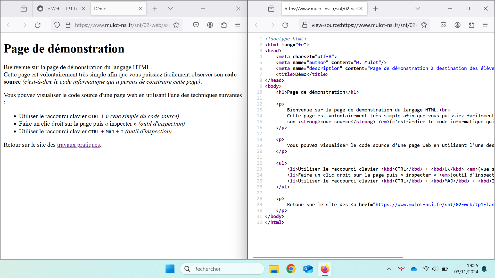

# Analyse d'une page web

## Introduction

Toutes les pages que vous consultez sur le Web sont construites à partir d'un même langage informatique :
le langage **HTML** *(HyperText Markup Language)*.

Ce langage, créé spécialement pour le web, permet de donner des instructions au navigateur afin de **structurer le contenu** d'une page.
C'est grâce à lui que vous pouvez voir du texte, des images, des liens et bien d'autres éléments sur les sites web.

## Analyse d'une page web

### Le code source

Le **code source** est comme une recette de cuisine pour l'ordinateur : c'est un ensemble d'instructions écrites qui lui expliquent quoi faire.
Pour créer une page web, ces instructions sont écrites en langage HTML. Quand vous visitez un site web, votre navigateur lit ce code source HTML et le transforme en la page que vous voyez à l'écran.

Pour consulter une page web, vous avez besoin d'un **navigateur web** *(Firefox, Chrome, Edge…)*. 
Il fonctionne comme un traducteur : il lit le code HTML et le transforme en une page avec des textes, des images et des boutons que vous pouvez comprendre.
Mais à quoi ressemble le code HTML que le navigateur traduit pour nous ?

!!! note "Instructions"

    Il est possible de visualiser le code source de n'importe quelle page web directement depuis un navigateur web.

    1. Rendez-vous sur la page de démonstration en cliquant sur ce lien : [:material-link: demo.html](assets/demo.html){:target="_blank"}
    2. Une fois sur cette page, utilisez le raccourci clavier ++ctrl+u++
    3. **Observez** attentivement la page web et son code source côte à côte.
       Essayez de repérer quels mots du code source correspondent à ce que vous voyez sur la page, et quels mots sont des instructions spéciales qui servent à organiser le contenu.
       À votre avis, à quoi servent ces instructions spéciales ?<br><br>
       

??? success "Observations attendues"

    En observant le code source, vous remarquerez que certains mots spéciaux comme `#!html <h1>`, `#!html <p>` ou `#!html <strong>` n'apparaissent pas sur la page web finale.
    Ces mots sont appelés **balises** : ce sont les briques de construction du langage HTML. 
    Ils indiquent au navigateur comment organiser et présenter chaque élément de la page.

### Les balises HTML

Les balises HTML sont des mots-clés qui permettent de structurer tout ce qui apparaît sur une page web.
Chaque balise a un rôle précis : certaines créent des paragraphes, d'autres des titres ou de mettre du texte en gras.
Découvrons ensemble les balises les plus courantes qui vous permettront de créer votre première page web.

!!! info "Saisir le contenu d'une page"

    La balise `#!html <body>` délimite tout ce qui sera visible sur votre page web.
    C'est comme une grande feuille blanche qui contient tout le contenu de votre page.
    C'est donc à l'intérieur des balises `#!html <body>[…]</body>` qu'il faut écrire tout contenu.

    ```html hl_lines="5-8"
    <html>
        <head>
            […]
        </head>
        <body> <!--(1)!-->
            <h1>Titre principal</h1>
            <p>Un paragraphe de texte</p>
        </body> <!--(2)!-->
    </html>
    ```

    1. La balise `#!html <body>` est une balise **ouvrante**. Elle indique le début du *corps* de la page.
    2. La balise `#!html </body>` est une balise **fermante**. Elle indique la fin du *corps* de la page.
    
    {==

    :material-alert: Le décalage vers la droite des balises, qu'on appelle **indentation**, est simplement une façon d'organiser le code pour qu'il soit plus facile à lire pour les humains.
    Pour l'ordinateur, en HTML, ces espaces ainsi que les sauts de ligne n'ont aucune importance.

    ==}

!!! info "Structurer le contenu"

    Vous pouvez structurer un contenu avec différents niveaux de titres (du plus important `#!html <h1>` au plus petit `#!html <h6>`), et séparer vos textes en paragraphes avec `#!html <p>`.
    C'est exactement comme lorsque vous rédigez un document avec des grands titres, des sous-titres et des paragraphes.

    Le code HTML ci-dessous est modifiable. N'hésitez pas à expérimenter en modifiant ou ajoutant des titres et des paragraphes.

    <p class="codepen" data-height="300" data-default-tab="html,result" data-slug-hash="qBeyNjm" data-pen-title="Structurer un contenu" data-editable="true" data-user="mulot-nsi" style="height: 300px; box-sizing: border-box; display: flex; align-items: center; justify-content: center; border: 2px solid; margin: 1em 0; padding: 1em;">
      <span>See the Pen <a href="https://codepen.io/mulot-nsi/pen/qBeyNjm">
      Structurer un contenu</a> by Mulot NSI (<a href="https://codepen.io/mulot-nsi">@mulot-nsi</a>)
      on <a href="https://codepen.io">CodePen</a>.</span>
    </p>
    <script async src="https://cpwebassets.codepen.io/assets/embed/ei.js"></script>
    

!!! info "Mettre en valeur du texte"

    Pour mettre en valeur certains mots dans vos textes, vous pouvez utiliser les balises `#!html <strong>` pour les mettre en gras et `#!html <em>` pour les mettre en italique.

    Le code HTML ci-dessous est modifiable. N'hésitez pas à expérimenter en modifiant les mots mis en gras ou en italique.

    <p class="codepen" data-height="300" data-default-tab="html,result" data-slug-hash="jOgprYg" data-pen-title="Mettre en valeur du texte" data-editable="true" data-user="mulot-nsi" style="height: 300px; box-sizing: border-box; display: flex; align-items: center; justify-content: center; border: 2px solid; margin: 1em 0; padding: 1em;">
      <span>See the Pen <a href="https://codepen.io/mulot-nsi/pen/jOgprYg">
      Mettre en valeur du texte</a> by Mulot NSI (<a href="https://codepen.io/mulot-nsi">@mulot-nsi</a>)
      on <a href="https://codepen.io">CodePen</a>.</span>
    </p>
    <script async src="https://cpwebassets.codepen.io/assets/embed/ei.js"></script>


### Inspection d'une page

Il existe une autre façon de consulter le code source d'une page web en utilisant la fonction **inspecter** du
navigateur.
Celle-ci permet de retrouver le code HTML associée à une partie visible de la page ou inversement, de retrouver la zone
d'affichage correspondant à une portion du code source.

!!! note "Instructions"

    1. Retournez sur la page de démonstration : [:material-link: demo.html](assets/demo.html){:target="_blank"}
    2. Depuis cette page, lancez l'inspecteur de code source en utilisant l'une des méthodes suivantes :
        - Méthode 1 : faire un clic droit sur la page puis **Inspecter**
        - Méthode 2 : utiliser le raccourci clavier ++ctrl+shift+i++
    3. Identifiez les balises permettant la construction de la liste à puces<br>
       *(visuellement, c'est la liste des techniques d'accès au code source d'une page web)*<br><br>
       