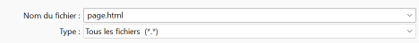
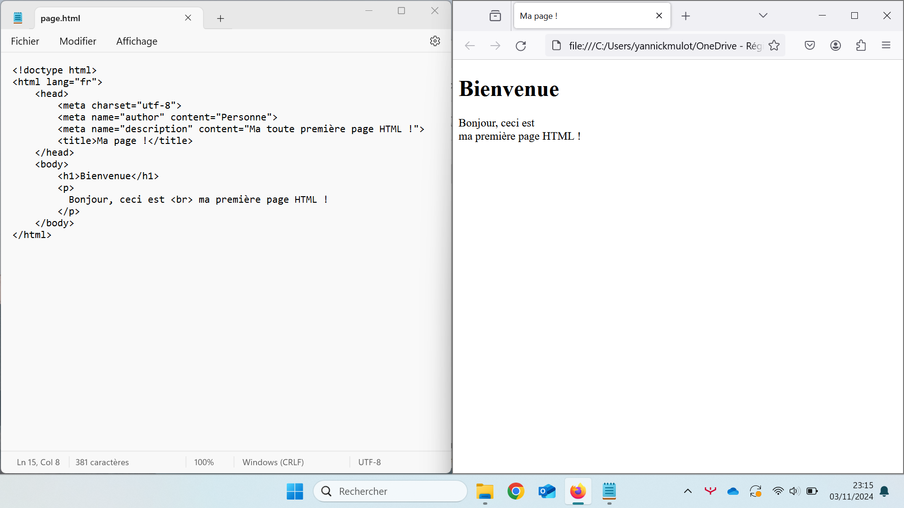

# Programmation

## Introduction

Toutes les pages que vous consultez sur le web sont construites avec un même langage informatique : le HTML *(HyperText Markup Language)*. 
Cette activité a pour objectif de vous faire découvrir ce langage étape par étape en créant votre première page web en la modifiant.

!!! danger "Activité Capytale"

    Cette activité doit être réalisée sous Capytale qui nécessite un accès fonctionnel à l'ENT.

    - **Mon accès à l'ENT fonctionne**, je fais l'activité en suivant les consignes directement sur Capytale. Je m'y rends via le lien [:material-link: SNT02 - Programmation HTML](https://capytale2.ac-paris.fr/web/c/f9a8-7982973){:target="_blank"}, me connecte, puis clique sur le bouton **Go !**
    - **Mon accès à l'ENT ne fonctionne pas**, et uniquement dans ce cas, je continue à suivre les instructions de cette page

## Préparation

### Création du dossier de travail

Vous allez créer des dossiers afin de ne pas mélanger vos productions numériques entre vos différentes matières et
travaux pratiques.

!!! note "Organisation de l'espace travail"

    === ":material-laptop: Ordinateur portable"

        1. Lancez l'application <i class="icon file-explorer"></i> **Explorateur de fichiers** 
           <span class="keys shortcut"><kbd>:fontawesome-brands-windows:</kbd><span>+</span><kbd>E</kbd></span>
        2. Dans le dossier `Document`, s'il n'y a pas de dossier nommé `SNT`, créez-le
        3. Dans le dossier `SNT`, s'il n'y a pas de dossier `web`, créez-le
        4. Dans le dossier `web`, créez le dossier `langage_html`

    === ":material-desktop-tower: Ordinateur fixe"

        1. Depuis le bureau, double-cliquez sur l'icône intitulée **Zone personnelle**
        2. Dans la **zone personnelle**, s'il n'y a pas de dossier nommé `SNT`, créez-le
        3. Dans le dossier `SNT`, s'il n'y a pas de dossier `web`, créez-le
        4. Dans le dossier `web`, créez le dossier `langage_html`

### Configuration de l'ordinateur

Afin de mieux pouvoir identifier le type d'un fichier, il est nécessaire d'activer l'option **Extensions de noms de fichiers**
de l'explorateur de fichiers Windows

!!! note "Organisation de l'espace travail"

    === ":material-laptop: Ordinateur portable"

        1. Lancez l'application <i class="icon file-explorer"></i> **Explorateur de fichiers** 
           <span class="keys shortcut"><kbd>:fontawesome-brands-windows:</kbd><span>+</span><kbd>E</kbd></span>
        2. Accédez à l'entrée **Afficher** de la barre d'outils
        3. Accédez au sous-menu **Afficher**
        4. Vérifiez que l'option **Extensions de noms de fichiers** soit bien cochée

            

    === ":material-desktop-tower: Ordinateur fixe"

        Appelez votre enseignant afin qu'il vous montre comment activer l'option

## Création d'une page web

Pour créer une page web, vous aurez besoin de deux outils très simples : le Bloc-notes pour écrire le code HTML, et un navigateur web pour voir le résultat.

### Création du fichier HTML

!!! note "Instructions"

    1. Lancez l'application **Bloc-notes**
    2. Copiez/collez le code HTML suivant :
        ```html
        <!doctype html>
        <html lang="fr">
            <head>
                <meta charset="utf-8">
                <meta name="author" content="Personne">
                <meta name="description" content="Ma toute première page HTML !">
                <title>Ma page !</title>
            </head>
            <body>
                <h1>Bienvenue</h1>
                <p>
                  Bonjour, ceci est <br> ma première page HTML !
                </p>
            </body>
        </html>
        ```
    3. Enregistrez le fichier dans le dossier `SNT\web\langage_html` en le nommant **page.html**
       
    !!! danger "Attention"
    
        Sélectionnez impérativement l'option **« Tous les fichiers (\*.\*) »** comme type de fichier au moment de la sauvegarde.
        Sans cela, le fichier sera enregistré avec l'extension `.txt` au lieu de `.html`.
        <p style="text-align:center"></p>

### Visualisation de la page HTML

!!! note "Instructions"

    1. Lancez l'application <i class="icon file-explorer"></i> **Explorateur de fichiers** 
       <span class="keys shortcut"><kbd>:fontawesome-brands-windows:</kbd><span>+</span><kbd>E</kbd></span>
    2. Déplacez-vous dans le dossier `SNT\web\langage_html`
    3. Double-cliquez sur le fichier **page.html** créé précédemment<br>
       *(un navigateur Web doit se lancer automatiquement et présenter le contenu de celle-ci)*
    4. Organisez vos fenêtres de manière à voir le bloc-notes avec le code source d'un côté et la visualisation de la page de l'autre<br><br>
       

Une page web est en réalité un **simple fichie**r d'extension `.html`. 
Contrairement à un document Word qui contient déjà la mise en forme *(couleurs, tailles de texte, soulignements…)*,
un fichier HTML ne contient que du **texte brut** avec les balises que nous avons découvertes.
C'est ensuite le navigateur qui se charge de mettre en forme votre page.

## Modification d'une page web

### Modification du corps

La balise `#!html <body>` permet de définir l'élément **corps** d'une page, c'est-à-dire le contenu visible dans
le navigateur Web.

!!! note "Instructions"

    1. Retournez au **Bloc-notes** avec le fichier **page.html** ouvert
    2. Remplacez le contenu des balises `#!html <h1>[…]</h1>` *(sans supprimer celles-ci)* par le texte suivant :
    ```
    La Cigale et la Fourmi
    ```
    
    3. Enregistrez vos modifications <span class="keys shortcut">++ctrl+s++</span>
    4. Retournez dans le **navigateur web** avec la page `page.html` ouverte
    5. Rechargez la page afin de rendre visible vos modifications :
        - en appuyant sur la touche ++f5++
        - ou en utilisant le raccourci clavier ++ctrl+r++ 
    6. Vérifiez que votre modification soit bien présente

!!! note "Instructions"

    1. Remplacez le contenu des balises `#!html <p>[…]</p>` *(sans supprimer celles-ci)* par cet extrait de *La Cigale et la Fourmi* de Jean de La Fontaine :
    ```
    La Cigale, ayant chanté
    Tout l'été,
    Se trouva fort dépourvue
    Quand la bise fut venue.
    Pas un seul petit morceau
    De mouche ou de vermisseau.
    Elle alla crier famine
    Chez la Fourmi sa voisine,
    La priant de lui prêter
    Quelque grain pour subsister
    Jusqu'à la saison nouvelle.
    ```
    
    2. Enregistrez votre fichier <span class="keys shortcut">++ctrl+s++</span>
    3. Retournez dans le navigateur
    5. Actualisez la page <span class="keys shortcut">++f5++ ou ++ctrl+r++</span>
    5. Qu'observez-vous ? L'organisation du texte a-t-elle été conservée ?

!!! info "Les sauts de ligne"

    En HTML, les sauts de ligne présents dans le code source ne sont pas pris en compte, tout comme les espacements multiples.
    Tout saut de ligne doit être explicitement indiqué par la balise `#!html <br>`

!!! note "Instructions"

    Ajoutez la balise `<br>` à la fin de chaque ligne afin de correctement mettre en forme le texte.<br>
    *(ne les écrivez pas manuellement une par une, vous pouvez faire des copier/coller)*

??? Success "Correction"

    ```html
    <!doctype html>
    <html lang="fr">
        <head>
            <meta charset="utf-8">
            <meta name="author" content="Jean de La Fontaine">
            <meta name="description" content="La Cigale et la Fourmi de Jean de La Fontaine">
            <title>Fables - La Cigale et la Fourmi</title>
        </head>
        <body>
            <h1>La Cigale et la Fourmi</h1>
            <p>
                La Cigale, ayant chanté<br>
                Tout l'été,<br>
                Se trouva fort dépourvue<br>
                Quand la bise fut venue.<br>
                Pas un seul petit morceau<br>
                De mouche ou de vermisseau.<br>
                Elle alla crier famine<br>
                Chez la Fourmi sa voisine,<br>
                La priant de lui prêter<br>
                Quelque grain pour subsister<br>
                Jusqu'à la saison nouvelle.
            </p>
        </body>
    </html>
    ```

### Modification de l'en-tête

La balise `#!html <title></title>` permet de définir l'élément **titre** d'une page. Elle est contenue entre les
balises `#!html <head></head>`
qui définissent l'élément **en-tête**. Ce dernier élément est utilisé pour préciser certaines caractéristiques et
informations concernant la page.
Aucune des données renseignées n'est directement visible pour l'internaute à l'exception du titre.

!!! note "Modification du titre d'une page web"

    1. Retournez au **Bloc-notes**
    2. Trouvez le texte **« Ma page ! »** au sein du code. Il est situé au niveau des balises `#!html <title></title>`.
    3. Remplacez **« Ma page ! »** par le texte de votre choix
    4. Enregistrez vos modifications <span class="keys shortcut">++ctrl+s++</span>
    5. Retournez dans le navigateur
    6. Rechargez cette page afin de rendre visible vos modifications :
        - en appuyant sur la touche ++f5++
        - ou en utilisant le raccourci clavier ++ctrl+r++ 
    7. Localisez l'endroit, dans tout le navigateur, où est affiché votre nouveau titre (cherchez bien 🧐 !). 
       <br>Constatez-vous le changement ?

!!! tip "Les métadonnées"

    Les informations renseignées via les balises `#!html <meta name="author" …>` et `#!html <meta name="description" …>`
    sont des **métadonnées**. Celles-ci donnent des informations sur le contenu d'une page web.
    Elles sont entre autres utilisées par les moteurs de recherche *(Google, Bing…)* pour afficher le résumé de 
    chaque élément du résultat d'une recherche.