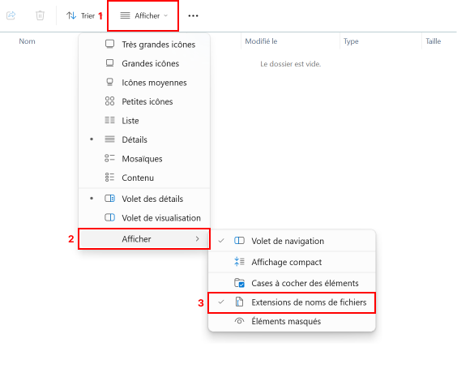

# Première page web

## Introduction

Toutes les pages que vous consultez sur le web sont construites avec un même langage informatique : le HTML *(HyperText Markup Language)*. 
Cette activité a pour objectif de vous faire découvrir ce langage étape par étape en créant votre première page web en la modifiant.

!!! danger "Activité Capytale"

    Cette activité doit être réalisée sous Capytale qui nécessite un accès fonctionnel à l'ENT.

    - **Mon accès à l'ENT fonctionne**, je fais l'activité en suivant les consignes directement sur Capytale. Je m'y rends via le lien [:material-link: SNT02 - Première page HTML](https://capytale2.ac-paris.fr/web/c/845d-7983402){:target="_blank"}, me connecte, puis clique sur le bouton **Go !**
    - **Mon accès à l'ENT ne fonctionne pas**, et uniquement dans ce cas, je continue à suivre les instructions de cette page

## Préparation

### Création du dossier de travail

Vous allez créer des dossiers afin de ne pas mélanger vos productions numériques entre vos différentes matières et
travaux pratiques.

??? note "Organisation de l'espace travail"

    === ":material-laptop: Ordinateur portable"

        1. Lancez l'application <i class="icon file-explorer"></i> **Explorateur de fichiers** 
           <span class="keys shortcut"><kbd>:fontawesome-brands-windows:</kbd><span>+</span><kbd>E</kbd></span>
        2. Dans le dossier `Document`, s'il n'y a pas de dossier nommé `SNT`, créez-le
        3. Dans le dossier `SNT`, s'il n'y a pas de dossier `web`, créez-le
        4. Dans le dossier `web`, créez le dossier `langage_html`

    === ":material-desktop-tower: Ordinateur fixe"

        1. Depuis le bureau, double-cliquez sur l'icône intitulée **Zone personnelle**
        2. Dans la **zone personnelle**, s'il n'y a pas de dossier nommé `SNT`, créez-le
        3. Dans le dossier `SNT`, s'il n'y a pas de dossier `web`, créez-le
        4. Dans le dossier `web`, créez le dossier `langage_html`

### Configuration de l'ordinateur

Afin de mieux pouvoir identifier le type d'un fichier, il est nécessaire d'activer l'option **Extensions de noms de fichiers**
de l'explorateur de fichiers Windows

??? note "Organisation de l'espace travail"

    === ":material-laptop: Ordinateur portable"

        1. Lancez l'application <i class="icon file-explorer"></i> **Explorateur de fichiers** 
           <span class="keys shortcut"><kbd>:fontawesome-brands-windows:</kbd><span>+</span><kbd>E</kbd></span>
        2. Accédez à l'entrée **Afficher** de la barre d'outils
        3. Accédez au sous-menu **Afficher**
        4. Vérifiez que l'option **Extensions de noms de fichiers** soit bien cochée

            

    === ":material-desktop-tower: Ordinateur fixe"

        Appelez votre enseignant afin qu'il vous montre comment activer l'option

## Création de la page

Vous allez maintenant créer une page web dédiée à la description de votre film préféré (ou série préférée).

!!! question "Pas de film préféré ?"

    À défaut d'avoir un film préféré, décrire le film *Intouchables*. C'est actuellement le 3<sup>ème</sup> film ayant
    totalisé le plus d'entrées en France à ce jour avec 19 490 688 entrées.

!!! note "Création d'une nouvelle page web"

    1. Créez un nouveau fichier dans avec le Bloc-notes
    2. Copiez/collez le code de l'amorce de page ci-dessous :
    ```html
    <!doctype html>
    <html lang="fr"> 
        <head>
            <meta charset="utf-8">
            <title>Mon Film Préféré</title>
        </head>
        
        <body>
            TITRE DU FILM
            
            <p></p>
            
            <p><em>Ce document a été réalisé par PRENOM NOM</em></p>
            
            Informations générales
            
            <ul>
                <li>Année de Sortie :</li>
                <li>Réalisateur :</li>
                <li>Acteurs Principaux :</li>
                <li>Genre :</li>
            </ul>
            
            Résumé
            
            Sources des informations et médias
        </body>
    </html>
    ```
    4. Enregistrez immédiatement le fichier dans le dossier `SNT\web\langage_html` en le nommant `film.html`
    5. Visualisez votre page dans un navigateur

## Structuration du texte

### Les éléments de titre

En HTML, il est possible de créer des éléments de titre au sein d'une page grâce aux balises suivantes :

- `#!html <h1></h1>` *(titre)*,
- `#!html <h2></h2>` *(sous-titre)*,
- `#!html <h3></h3>` *(sous-sous-titre)*
- …
- `#!html <h6></h6>`

!!! note "Définition du titre principal"

    1. Remplacez le texte « TITRE DU FILM » par le nom de votre film préféré
    2. Englobez le nom du film par des balises `#!html <h1></h1>` afin de créer un élément « titre de niveau 1 » *(ou titre)* 
    3. Enregistrez vos modifications et visualisez le résultat dans le navigateur    

!!! example "Exemple de titre principal"

    === "Avant"

        ```html
        TITRE DU FILM
        ```

    === "Après"

        ```html
        <h1>La Belle et la Bête</h1>
        ```

!!! note "Définition des titres secondaires"

    1. Recherchez les textes listés ci-dessous **dans le contenu** de la page web :
        - Informations générales
        - Résumé
        - Sources d'information
    2. Englobez chacun d'eux par des balises `#!html <h2></h2>`. 
       Ces balises permettent de créer des éléments « titre de niveau 2 » *(ou sous-titres)*.
    3. Visualiser le résultat *(toujours en enregistrant et actualisant)*

!!! example "Exemple de titre secondaire"

    === "Avant"

        ```html
        Informations générales
        ```

    === "Après"

        ```html
        <h2>Informations générales</h2>
        ```

### L'élément de haute importance

Vous allez compléter la section *Information générale* et utiliser une nouvelle balise pour mettre en valeur les
descripteurs *(Année de sortie, Réalisateur…)*.

!!! note "Mise en valeur de portions de texte"

    1. Renseignez les informations générales du film choisi
    2. Englobez chacun des textes suivants par le couple de balises `#!html <strong></strong>` :
        - Année de Sortie :
        - Réalisateur :
        - Acteurs Principaux :
        - Genre :

!!! example "Exemple de mise en valeur"

    === "Avant"
        
        ```html 
        <li>Année de Sortie :</li>
        <li>Réalisateur :</li>
        ```

    === "Après"

        ```html
        <li><strong>Année de sortie :</strong> 1968</li>
        <li><strong>Réalisateur :</strong> Stanley Kubrick</li>
        ```

### L'élément paragraphe

Vous allez ajouter du contenu à la section *Résumé*. Sur papier, les longs textes sont structurés en paragraphes.
Il est possible de faire de même en HTML à l'aide de l'élément paragraphe défini par le couple de
balise `#!html <p></p>`.

!!! note "Gestion des paragraphes"

    1. Retrouvez un résumé de votre film
    2. Copiez/collez le texte trouvé *(vous êtes autorisés pour cette fois-ci, mais ça reste du plagiat et c'est interdit)*
    3. Le structurez en paragraphes à l'aide de couples de balises `#!html <p></p>`

!!! example "Exemple de paragraphes"

    Exemple de paragraphe très court.
    
    ```html
    <p>Une seule ligne</p>
    ```
    
    Les sauts de ligne n'étant pas significatifs, il est possible d'écrire ce même paragraphe comme ci-dessous.
    
    ```html
    <p>
        Une seule ligne
    </p>
    ```
    
    Il est possible de définir plusieurs paragraphes à la suite.
    Un passage à la ligne est automatiquement appliqué par le navigateur après chaque paragraphe.
    
    ```html
    <p>Paragraphe 1</p>
    <p>Paragraphe 2</p>
    ```

### L'élément lien hypertexte

L'une des fonctionnalités révolutionnaires du Web est le **lien hypertexte**, c'est-à-dire la possibilité d'insérer un
lien vers une autre page située n'importe où sur le Web.
Un élément lien hypertexte se crée grâce au couple de balises `#!html <a href=""></a>`. Vous constaterez une différence
par
rapport aux autres balises déjà rencontrées par la présence de `href=""`.

!!! info "Cours - Les attributs d'une balise HTML"

    Le texte `href=""` est un *attribut* de la balise `#!html <a>`. Tout attribut a un nom (ici `href`) et une valeur (écrite entre guillemets).
    Les attributs permettent de transmettre des informations à une balise dont le fonctionnement se verra impacté.
    
    L'attribut `href` permet d'indiquer l'URL du contenu vers lequel nous souhaitons faire pointer le lien hypertexte.
    Le texte englobé par les balises `#!html <a>` sera mis en valeur et rendu cliquable.

!!! example "Exemple - L'élément lien hypertexte"

    Voici un texte comportant un lien hypertexte vers le site de lycée. Le texte cliquable sera *site du lycée*.
    
    === ":material-code-tags: Code"
        ```html
        Rendez-vous sur le <a href="http://www.lyceebachelardchelles.fr">site du lycée</a>
        ``` 
    === ":material-application-outline: Affichage"
        Rendez-vous sur le [site du lycée](http://www.lyceebachelardchelles.fr){:target="_blank"}

!!! note "Création de liens hypertextes"

    1. Retrouvez l'URL des pages où vous avez trouvé les informations concernant votre film
    2. Ajoutez dans la section **Sources** un paragraphe précisant les sites utilisés en insérant un lien vers chacun

### L'élément image

Il est possible d'insérer un élément image sur une page Web grâce à la balise `#!html `. Elle dispose des attributs
suivants :

- L'attribut `src` qui est le chemin ou l'URL d'une image
- L'attribut `alt` qui est un texte alternatif qui sera présenté par le navigateur si l'affichage de l'image se révèle
  impossible

!!! example "Exemple - L'élément image"

    Nous avons téléchargé un fichier image `image_800x600.jpg` que nous avons enregistré dans le même dossier que notre page web.
    Cette image représente l'affiche du film *Intouchable*. Voici ci-dessous le code de la balise `#!html ` dans cette situation.

    === ":material-code-tags: Code"
        ```html
        
        ```
    === ":material-application-outline: Affichage"
        

!!! note "Insertion d'une image"

    1. Trouvez sur le Web une image de l'affiche de votre film au format `.jpg` ou `.png`
    2. Téléchargez l'image et enregistrez-la dans le même dossier que le fichier `film.html`
    3. Modifiez la balise `` déjà présente dans la page en conséquence
    4. Visualisez le résultat

## Vous avez terminé ?

### Les métiers du Web

Vous pouvez découvrir les métiers du Web sur le site de l'ONISEP.

!!! info "Les métiers du Web"

    - [:material-link: Intégrateur/trice web](https://www.onisep.fr/Ressources/Univers-Metier/Metiers/integrateur-integratrice-web){:target="_blank"}
    - [:material-link: Webdesigner](https://www.onisep.fr/Ressources/Univers-Metier/Metiers/webdesigner){:target="_blank"}
    - [:material-link: Web-ergonome](https://www.onisep.fr/Ressources/Univers-Metier/Metiers/web-ergonome){:target="_blank"}
    - [:material-link: Spécialiste de l'accessibilité numérique](https://www.onisep.fr/Ressources/Univers-Metier/Metiers/specialiste-de-l-accessibilite-numerique){:target="_blank"}
    - [:material-link: Traffic Manager](https://www.onisep.fr/Ressources/Univers-Metier/Metiers/traffic-manager){:target="_blank"}
    - [:material-link: Chef/fe de projet Web](https://www.onisep.fr/Ressources/Univers-Metier/Metiers/chef-cheffe-de-projet-web-mobile){:target="_blank"}
    - [:material-link: Webmestre](https://www.onisep.fr/Ressources/Univers-Metier/Metiers/webmestre){:target="_blank"}
    - [:material-link: Rédacteur/trice](https://www.onisep.fr/Ressources/Univers-Metier/Metiers/redacteur-redactrice-on-line){:target="_blank"}