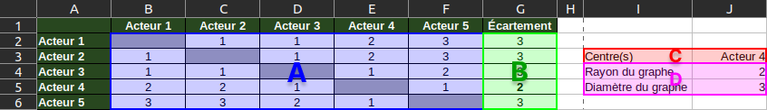

# Caractéristiques d'un graphe

## Introduction

Vous avez construit en [:material-link: activité 1](activite1.md){target="_blank"} le graphe du réseau social formé par les acteurs de Christopher Nolan. Vous vous interrogez maintenant sur la ou les personnes qu'il serait judicieux de contacter
en premier.

Heureusement, grâce à vos cours de SNT, vous savez qu'il est possible de trouver le (ou les) centre(s) d'un graphe, mais en
quoi est-ce utile ? Dans le cas présent, trouver le centre du graphe, c'est trouver la personne qui a accès à l'ensemble des membres du
réseau en faisant intervenir le moins d'intermédiaires possible.

!!! danger "Travail à rendre"

    Le travail réalisé dans le cadre de ces travaux pratiques est à rendre en fin de séance selon les modalités décrites dans la section **Envoi du travail**.
    
## Appplication

Pour trouver le centre du graphe, il vous faut déterminer l'ensemble des distances puis l'écartement de chaque sommet.
Une fois le(s) centre(s) trouvé(s), il vous restera à préciser le rayon et le diamètre du graphe.

| N° | Caractéristique | Définition                                                                 |
|:--:|:---------------:|:---------------------------------------------------------------------------|
| 1  |    Distance     | Nombre **minimum** d'arêtes reliant deux sommets                           |
| 2  |   Écartement    | **La plus grande distance** entre un sommet et tout autre sommet du graphe |
| 3  |    Centre(s)    | Sommet(s) dont **l'écartement** est le plus petit                          |
| 4  |      Rayon      | Plus petit écartement du graphe (écartement d'un centre)                   |
| 4  |    Diamètre     | Plus grand écartement du graphe                                            |

!!! help "Tableau des caractéristiques du graphe"

    Vous allez construire le tableau des caractéristiques du graphe à l'aide d'un tableaur.
    Voici en image ce à quoi celui-ci pourrait ressembler.
    La numérotation en surimpression correspond à la liste des caractéristiques mentionnées plus haut et à déterminer pour
    votre propre graphe :

    - **A** - Les distances (nombre minimum d'arêtes entre un sommet et tous les autres du graphe)
    - **B** - Les écartements (la plus distance d'un sommet)
    - **C** - Le ou les centres (sommet(s) dont l'écartement est le plus petit)
    - **D** - Le rayon (plus petit écartement) et le diamètre (plus grand écartement)

    <figure markdown>
        {:style="max-width:100%;border:1px solid black;"}
    </figure>

!!! note "Consigne"

    Vous trouverez en téléchargement ci-dessous un début de tableau de caractéristiques
    qu'il vous faut compléter avec l'ensemble des acteurs et des caractéristiques demandées.
    Pensez à consulter l'aide pour voir ce à quoi doit ressembler votre tableau une fois terminé.

    1. Téléchargez l'amorce du tableau des caractéristiques : [:material-download: télécharger](assets/SNT03_caracteristiques.ods){:download="SNT03_caractéristiques.ods"}
    2. Déplacez le fichier `SNT03_caractéristiques.ods` téléchargé dans le dossier `Réseaux sociaux`
    3. Ouvrez le fichier avec **LibreOffice Calc** (ou à défaut, *Microsoft Excel*) :
        - Il y a une distance de 2 entre *Christian B.* et *Cillian M.* car deux arêtes les séparent sur le graphe  
        - Il y a une distance de 1 entre *Cillian M.* et *Tom H.* car ils sont directement liés par une arête
    4. Complétez le tableau

## Envoi du travail

Une fois votre tableau complété, vous pouvez le déposer sur Pronote.

!!! info "Dépot du travail sur Pronote"

    1. Connectez-vous à l'ENT : [:material-link: https://monlycee.net](https://monlycee.net/){:target="_blank"}
    3. Accédez à l'application **Pronote**
    4. Depuis l'accueil, recherchez le devoir intitulé **SNT03 - 2. Caractéristiques d'un graphe**
    5. Cliquez sur le bouton Déposer ma copie
    6. Cliquez sur le bouton **Un seul fichier (*.pdf, *.doc, ...)**
    7. Déposez votre fichier tableur
