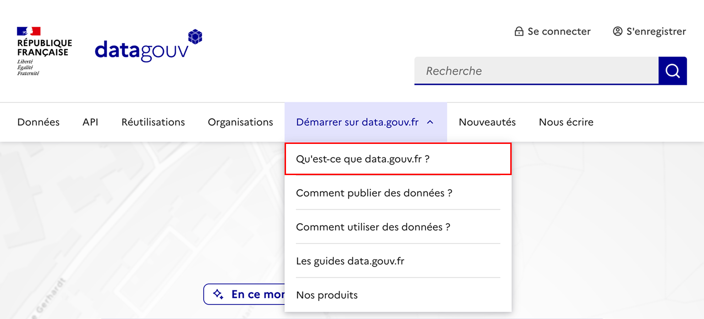
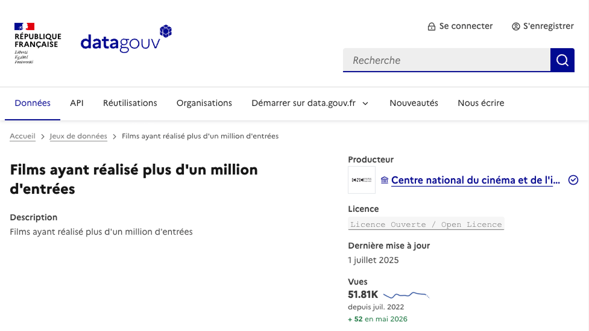
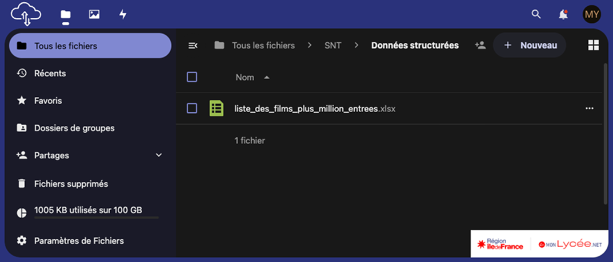
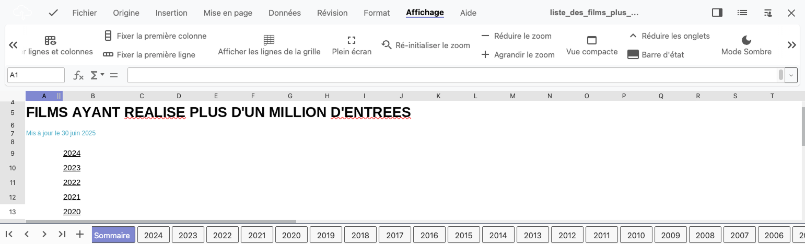

# Données ouvertes

## Introduction

Ces travaux pratiques ont pour objectif de vous faire découvrir ce que sont les données ouvertes *(Open Data)*.

## Préparation

Vous allez créer des dossiers afin de ne pas mélanger vos productions numériques entre vos différentes matières et
travaux pratiques.

!!! note "Organisation de l'espace travail"

    === ":material-cloud: Mon drive Monlycée"

        1. Connectez-vous à l'ENT : [:material-link: https://monlycee.net/](https://monlycee.net/){:target="_blank"}
        2. Accédez à l'application **Mon drive monlycée**
        3. S'il n'existe pas de dossier `SNT`, créez-le
        4. Entrez dans le dossier `SNT`
        5. S'il n'existe pas de dossier `Données structurées`, créez-le 

    === ":material-laptop: Ordinateur portable"

        1. Lancez l'application <i class="icon file-explorer"></i> **Explorateur de fichiers**
        2. Dans le dossier `Document`, s'il n'y a pas de dossier nommé `SNT`, créez-le
        3. Dans le dossier `SNT`, créez-le dossier `Données structurées`

    === ":material-desktop-tower: Ordinateur fixe"

        1. Depuis le bureau, double-cliquez sur l'icône intitulée **Zone personnelle**
        2. Dans la **zone personnelle**, s'il n'y a pas de dossier nommé `SNT`, créez-le
        3. Dans le dossier `SNT`, créez-le dossier `Données structurées`

## Application

### Découverte du site data.gouv.fr

!!! note "Consigne"

    1. Rendez-vous sur le site [:material-link: data.gouv.fr](https://data.gouv.fr){:target="_blank"}
    2. Repérez le menu principal (le bandeau de liens en haut de page ou bien l'icône :material-menu:)
    3. Cliquez sur l'entrée **Démarrer sur data.gouv.fr**

        <figure markdown>
            {:style="max-width:75%;border:1px solid black;"}
        </figure>

    4. Cliquez ensuite sur l'entrée **Qu'est-ce que data.gouv.fr ?**
    5. Lisez le contenu de la page intitulée **À propos de data.gouv.fr**

!!! question "Question"

    Qu'est-ce que **data.gouv.fr** et dans quel but ce site a-t-il été créé ?

??? success "Réponse"

    Le site web [:material-link: data.gouv.fr](https://data.gouv.fr){:target="_blank"} est la plateforme officielle où l'État Français partage gratuitement ses données avec tous les citoyens.
    Ce site a été créé pour favoriser la transparence gouvernementale et permettre à chacun d'accéder et de réutiliser ces informations.

    En tant qu'élève, vous pouvez y trouver des données utiles comme :

    - les [:material-link: résultats du baccalauréat](https://www.data.gouv.fr/datasets/le-baccalaureat-par-academie){:target="_blank"}
    - les [:material-link: taux d'insertion professionnelle](https://www.data.gouv.fr/datasets/insertion-professionnelle-des-diplomes-des-etablissements-denseignement-superieur-dispositif-insersup){:target="_blank"} en sortie d'études supérieures
    - les [:material-link: indices de position sociale des lycées](https://www.data.gouv.fr/datasets/ips-lycees-a-partir-de-2023){:target="_blank"}
    - ...

### Découverte d'un jeu de données

#### :material-link-variant: Accès aux jeux de données

!!! note "Consigne"
    
    1. Retournez sur la page d'accueil [:material-link: data.gouv.fr](https://data.gouv.fr){:target="_blank"}
    2. Cliquez sur l'entrée **Données** du menu principal
    3. Une fois sur la page **Rechercher un jeu de données**, trouvez la mention du nombre de jeux de données disponibles

!!! question "Question"
    
    Quel est le nombre total de jeux de données disponibles sur le site data.gouv.fr ?

??? success "Réponse"

    Au début du mois de mai 2026, le site data.gouv.fr disposait de **73 850** jeux de données.

#### :material-magnify: Recherche d'un jeu de données

!!! note "Consigne"
    
    1. Restez sur la page [:material-link: Rechercher un jeu de données](https://www.data.gouv.fr/datasets){:target="_blank"}
    2. Effectuez la recherche du jeu de données intitulé : `films million entrées` 
       :material-comment-alert: **Attention :** ne confondez pas avec le champ de recherche du site
    3. Cliquez sur le résultat intitulé [Films ayant réalisé plus d'un million d'entrées](https://www.data.gouv.fr/datasets/films-ayant-realise-plus-dun-million-dentrees){:target="_blank"}

        <figure markdown>
            {:style="max-width:75%;border:1px solid black;"}
        </figure>

    4. Trouvez sur la page descriptive du jeu de données les réponses aux questions ci-après

!!! question "Questions"
    
    - Qui a produit et partagé ce jeu de données ?
    - Quand le fichier a-t-il était mis à jour pour la dernière fois ?
    - Quelle est la fréquence de mise à jour des données ? 
      :material-comment-alert: Consultez le contenu de l'onglet **Informations** pour répondre à cette question

??? success "Réponses"

    - Ce jeu de données a été produites et partagées par le **CNC** *(Centre National du Cinéma et de l'image animée)*
    - La dernière mise à jour du fichier remonte au **1 juillet 2025**
    - Les données sont mise à jour **une fois par an**

### Télécharger un jeu de données

!!! note "Consigne"

    1. Restez sur la page [:material-link: Films ayant réalisé plus d'un million d'entrées](https://www.data.gouv.fr/fr/datasets/films-ayant-realise-plus-dun-million-dentrees/){:target="_blank"}
    2. Accédez à l'onglet **Fichiers**
    3. Cliquez sur le bouton :material-download:**Télécharger**  
       :material-alert: **Attention :** en cas de problème de téléchargement, suivez les instructions ci-dessous

!!! danger "Le téléchargement ne fonctionne pas ?"

    En cas de problème de téléchargement, le fichier est directement disponible ici : 
    [:material-download: Films ayant réalisé plus d'un million d'entrées](assets/liste_des_films_plus_million_entrees.xlsx){:target="_blank"}

!!! note "Consigne"

    === ":material-cloud: Mon drive Monlycée"

        1. **Fermez le fichier téléchargé** si celui-ci s'est automatiquement ouvert
        2. Accédez à l'application **Mon drive Monlycée** de l'ENT 
        3. Accédez au dossier `SNT > Données structurées` créé en début de ces travaux pratiques
        4. Déposez-y le fichier `liste_des_films_plus_million_entrees.xlsx`
            <figure markdown>
                {:style="max-width:75%;border:1px solid black;"}
            </figure>
        5. Cliquez sur le fichier pour l'ouvrir directement depuis **Mon drive Monlycée**
            <figure markdown>
                {:style="max-width:75%;border:1px solid black;"}
            </figure>
        6. Si vous êtes en **mode sombre**, passez en mode clair via « Affichage »  puis le bouton « Mode sombre » 
        7. Passez à l'[activité 2](activite2.md)

    === ":material-laptop: Ordinateur portable"

        1. **Fermez le fichier téléchargé** si celui-ci s'est automatiquement ouvert 
           :material-comment-alert: Il ne vous sera pas possible de le déplacer par la suite s'il est ouvert
        2. Déplacez le fichier vers le dossier `SNT\Données structurées\TP1 - Données ouvertes`
        3. Double-cliquez sur le fichier pour l'ouvrir 
           :material-comment-alert: L'application Microsoft Excel ou LibreOffice Calc doit se lancer
        4. Passez à l'[activité 2](activite2.md)

    === ":material-desktop-tower: Ordinateur fixe"

        1. **Fermez le fichier téléchargé** si celui-ci s'est automatiquement ouvert 
           :material-comment-alert: Il ne vous sera pas possible de le déplacer par la suite s'il est ouvert
        2. Déplacez le fichier vers le dossier `SNT\Données structurées\TP1 - Données ouvertes`
        3. Double-cliquez sur le fichier pour l'ouvrir 
           :material-comment-alert: L'application Microsoft Excel ou LibreOffice Calc doit se lancer
        4. Passez à l'[activité 2](activite2.md)