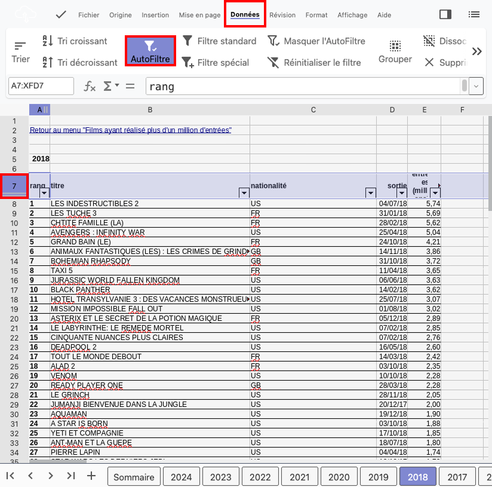
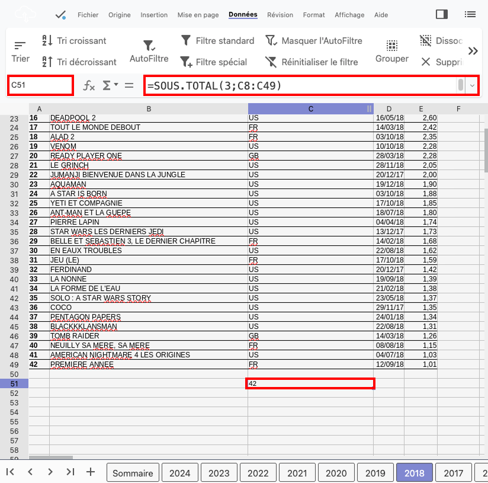
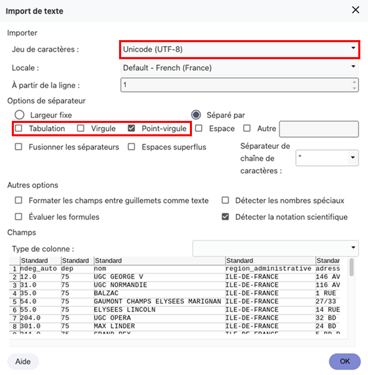

# Tableur

## Introduction

Ces travaux pratiques ont pour objectif de vous faire manipuler des données à l'aide d'une application tableur.

## Préparation

Vous allez créer des dossiers afin de ne pas mélanger vos productions numériques entre vos différentes matières et
travaux pratiques.

!!! note "Organisation de l'espace travail"

    === ":material-cloud: Mon drive Monlycée"

        1. Connectez-vous à l'ENT : [:material-link: https://monlycee.net/](https://monlycee.net/){:target="_blank"}
        2. Accédez à l'application **Mon drive monlycée**
        3. Accédez au dossier `SNT > Données structurées`
        4. Ouvrez le fichier `liste_des_films_plus_million_entrees.xlsx` déposé en [Activité 1](activite1.md)

    === ":material-laptop: Ordinateur portable"

        1. Lancez l'application <i class="icon file-explorer"></i> **Explorateur de fichiers**
        2. Accédez au dossier `Document`
        3. Accédez au dossier `SNT\Données structurées`
        4. Ouvrez le fichier `liste_des_films_plus_million_entrees.xlsx` téléchargé en [Activité 1](activite1.md)

    === ":material-desktop-tower: Ordinateur fixe"

        1. Depuis le bureau, double-cliquez sur l'icône intitulée **Zone personnelle**
        2. Accédez au dossier `SNT\Données structurées`
        3. Ouvrez le fichier `liste_des_films_plus_million_entrees.xlsx` téléchargé en [Activité 1](activite1.md)

## Application

!!! info "Fonctionnement d'un tableur"

    - Un **tableur** est un logiciel permettant la manipulation de données organisées sous forme de tableaux.
      Il est possible d'appliquer sur ces données divers traitements tels que : des tris, des filtres ou des calculs.
    - Un document créé via un tableur *(LibreOffice Calc, Microsoft Excel, ...)* est appelé **classeur**.
      Un classeur contient une ou plusieurs feuilles de calcul accessibles via des onglets.
    - Une **feuille de calcul** correspond à un tableau pouvant contenir des valeurs ou des formules de calcul.
      Les cases du tableau sont appelées cellules.
    - Chaque **cellule** est identifiable par sa **référence**.
      Une référence est formée de la lettre de la colonne suivie du numéro de ligne de la cellule.

    <figure markdown>
        {:style="max-width:100%;"}
    </figure>

### Analyse simple des données

!!! note "Consigne"

    1. S'il n'est pas déjà ouvert, ouvrez le classeur des **films ayant réalisé plus d'un million d'entées**
    2. Naviguez entre les années en cliquant sur les onglets pour changer de feuille de calcul 
       :material-comment-alert: Les onglets se trouvent en bas de la fenêtre
    3. Trouvez les réponses aux questions ci-après en explorant le classeur

!!! question "Préparation du QCM"

    - Quel film a fait le plus d'entrées en 2020 ?
    - Quel film français a fait le plus d'entrées en 2013 ?
    - Quelle est la nationalité du film ayant fait le plus d'entrées en 2024 ?

??? success "Réponses"

    - Le film ayant fait le plus d'entrées en 2020 est **Tenet**
    - Le film français ayant fait le plus d'entrées en 2013 est **Les Profs**
    - Le film ayant fait le plus d'entrées en 2024 est **français** 

### Filtrage des données

#### Activer les filtres

!!! note "Consigne"

    1. Rendez-vous sur la feuille de calcul de l'année **2018**
    2. Sélectionnez l'intégralité de la 7ème ligne en cliquant sur la **cellule grisée** située en bordure gauche et contenant le numéro 7.
       Cette ligne contient les **en-têtes du tableau** 
       :material-comment-alert: **Attention :** Ne confondez pas avec la ligne décrivant le film classé 7ème
    3. Activez les tris et les filtres en sélectionnant la fonction appropriée selon le logiciel utilisé 
       :material-comment-alert: consultez l'aide ci-dessous

!!! help "Aide - Activer les filtres"

    === ":material-table: Mon drive Monlycée"

        - *Barre de menu* ▸ Données ▸ AutoFiltre :material-filter:

        <figure markdown>
            {:style="max-width:75%;border:1px solid black;"}
        </figure>

    === ":material-microsoft-excel: Microsoft Excel"

        - *Barre de menu* ▸ Données ▸ Filtrer :material-filter:
        - vous pouvez aussi utiliser le raccourci clavier ++ctrl+shift+l++

    === ":material-table: Libre office Calc"

        - *Barre de menu* ▸ Données ▸ AutoFiltre :material-filter:
        - vous pouvez aussi utiliser le raccourci clavier ++ctrl+shift+l++

#### Utiliser les filtres

!!! note "Consigne"

    Nous souhaitons ne visualiser que les films français. Pour cela :

    - Cliquez sur le triangle qui est apparu à droite de l'en-tête de colonne **Nationalité**
    - Décochez tout sauf **FR** et répondez à la question 
      :material-comment-alert: Seuls les films français doivent désormais être visibles

!!! question "Question"
    
    Quels sont les trois films français ayant fait le plus d'entrées en 2018 ?

??? success "Réponse"
    
    Les trois films français ayant fait le plus d'entrées en 2018 sont :
    
    - Les Tuche 3
    - La Ch'tite famille
    - Le grand bain 

### Les fonctions de calcul

#### Nombre de films

!!! note "consigne"
    
    Nous souhaitons compter le nombre de films affichés une fois le filtre appliqué :

    1. Retournez sur la feuille de calcul de 2018
    2. Sélectionnez la cellule `C51`
    3. Saisissez-y la formule `=SOUS.TOTAL(3;C8:C49)` 
       :material-comment-alert: Respectez bien chaque élément de ponctuation (`=`, `;` et `:`) 
       :material-comment-alert: Une fois la formule saisie, le nombre de films affichés devrait apparaître dans la cellule `C51`.
         <figure markdown>
            {:style="max-width:75%;border:1px solid black;"}
        </figure>

!!! info "Explications"

    La fonction `SOUS.TOTAL` permet d'appliquer un traitement (le traitement numéro 3) sur un groupe de cellules
    (`C8:C49`). Ici `C8` correspond à la cellule du coin supérieur gauche de la sélection et `C49` celle du coin inférieur droit.
    Ces deux cellules faisant partie de la même colonne `C`, nous appliquons donc finalement le traitement sur les cellules de la ligne `8` à la ligne `49` de la colonne `C`.

    :material-alert: **Attention :** La cellule contenant la formule doit être séparée des données utilisées pour les calcul par au moins une ligne vide.
    C'est la raison pour laquelle nous avons écrit la formule en ligne 51 et non en ligne 50.

    La documentation complète de cette fonction est disponible sur le [:material-link: support Microsoft](https://support.microsoft.com/fr-fr/office/sous-total-sous-total-fonction-7b027003-f060-4ade-9040-e478765b9939)

!!! question "Question"
    
    Combien de films français ont dépassé le million d'entrées en 2018 ?

??? success "Réponse"

    **11 films** français ont dépassé le million d'entrées en 2018.

#### Nombre d'entrées

!!! note "consigne"

    Nous souhaitons maintenant connaître le nombre d'entrées cumulées d'une sélection de films :

    1. Retournez sur la feuille de calcul de 2018
    2. Sélectionnez la cellule `E51`
    3. Saisissez-y la formule `=SOUS.TOTAL(9;E8:E49)` 
       :material-comment-alert: Une fois la formule saisie, le nombre d'entrées cumulées devrait apparaître dans la cellule `E51`

!!! question "Questions"
    
    - Combien y a-t-il eu d'entrées cumulées pour les films français en 2018 ?
    - Combien y a-t-il eu d'entrées cumulées pour les films étrangers en 2018 ?

??? success "Réponses"
    
    - Le nombre d'entrées cumulées pour les films français en 2018 est de **32,25 millions**
    - Le nombre d'entrées cumulées pour les films étrangers en 2018 est de **72,90 millions**

#### Filtres et tris

!!! warning "Attention - Cellules contenant ###"

    Si la colonne **sortie** contient des `###`, cela signifie qu'elle n'est pas assez large pour afficher correctement les données.
    Il est possible de l'élargir. Pour cela :

    - Placer le curseur de la souris entre les lettres `D` et `E`
    - Maintenir le bouton gauche de la souris pressé
    - Glisser la souris vers la droite

!!! note "Consigne"

    1. Retournez sur la feuille de calcul de 2018
    2. Réinitialisez tous les filtres de façons à afficher tous les films de 2018 **(important)**
    3. Triez les films selon leur date de sortie croissante 
       :material-comment-alert: Cliquez sur le triangle à droite de l'en-tête de colonne « sortie »
    4. Vous devez constater la présence de quatre films sortis en 2017
    5. Appliquez le filtre permettant de les masquer
    6. En ajustant les autres filtres et le tri, répondez aux questions ci-après.

!!! question "Question"

    - Pour les films sortis en 2018 strictement, combien ont dépassé le million d'entrés ?
    - Quels sont les deux films américains en tête de liste ?

??? success "Réponses"

    - **38 films** sortis en 2018 ont dépassé le million d'entrés
    - Les deux films américains en tête de liste sont **Les indestructibles 2** et **Avengers : Infinity War**

## Nouveau jeu de données

!!! note "Consigne - Téléchargement des données"

    1. Rendez-vous sur la page des jeux de données de [:material-link: data.gouv.fr](https://www.data.gouv.fr/fr/datasets/){:target="_blank"}
    2. Dans le champ de recherche, saisissez les mots-clés : `salles cinéma`
    3. Accédez au jeu de données **Les salles de cinéma en Île-de-France** 
       :material-comment-alert: Celui fourni par la région Île-de-France et mis à jour le 6 décembre 2021
    4. Téléchargez le fichier au format `csv` sans l'ouvrir

!!! danger "Le téléchargement ne fonctionne pas ?"

    En cas de problème de téléchargement, le fichier est directement disponible ici : 
    [:material-download: Les salles de cinéma en Île-de-France](assets/les_salles_de_cinemas_en_ile-de-france.csv){:target="_blank"}

!!! note "Consigne - Ouverture du fichier"

    1. Déposez le fichier dans le dossier de travail `SNT > Données structurées`
    2. Ouvrez-le avec un tableur en cliquant dessus
    3. À l'ouverture du fichier, choisir « Unicode UTF-8 » comme jeu de caractère et uniquement le « point-virgule » comme séparateur
        <figure markdown>
            {:style="max-width:50%;border:1px solid black;"}
        </figure>

    6. **En utilisant les fonctionnalités de filtrage et de calcul**, répondez aux questions ci-après 
       :material-comment-alert: **Attention :** Conservez vos réponses dans un fichier texte ou sur une feuille, elles vous seront utiles pour répondre à un QCM Pronote.

!!! question "Questions"

    - Quelle est la salle de cinéma en Île-de-France ayant le plus de fauteuils ? Donner la ville, le nom de la salle et le nombre de fauteuils.
    - Combien d'écrans et de fauteuils dispose l'unique cinéma de Chelles ?
    - Combien de cinémas « Art et Essai » y a-t-il en Île-de-France ? (voir colonne Z)
    - Combien de fauteuils ont l'ensemble des dix plus gros cinémas d'Île-de-France (en nombre de fauteuils) ?
    - Combien de fauteuils ont l'ensemble des cinémas « Art et Essai » à Paris ?

!!! note "Consigne"
    
    Une fois que vous avez notez vos réponses dans un fichier texte, vérifiez vos résultats avec Pronote : 
    
    1. Connectez-vous à Pronote
    2. Accédez au **Cahier de textes**
    3. Accédez à **Contenu et ressources**
    4. Affichez le contenu des séances de **SC.NUMERIQ.TECHNOL.**
    5. Trouvez la séance **SNT04 - Les données ouvertes** et exécuter le QCM
