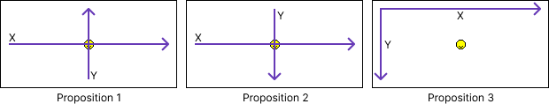

<form id="exercise" method="POST" markdown="1" action="/api/save">
<input type="hidden" name="exercise_id" value="snt_photo_manipulation">

# Manipulation d'une image

## Introduction

Ces travaux pratiques ont pour objectif de vous faire manipuler les pixels et les couleurs d'une image à l'aide du
langage de programmation Python.

## Identification

Avant de commencer les travaux pratiques, identifiez-vous via le formulaire ci-dessous.
Par la suite, vous répondrez aux questions directement dans les champs prévus à cet effet.

!!! info "Indentifiez-vous"
    <div>
        <label for="firstname">Prénom</label>
        <input id="firstname" type="text" name="firstname">
    </div>
    
    <div>
        <label for="lastname">Nom</label>
        <input id="lastname" type="text" name="lastname">
    </div>
    
    <div>
        <label for="group">Classe</label>
        <select id="group" name="group">
            <option value="SEC01">Seconde 1</option>
            <option value="SEC02">Seconde 2</option>
            <option value="SEC03">Seconde 3</option>
            <option value="SEC04">Seconde 4</option>
            <option value="SEC05">Seconde 5</option>
            <option value="SEC06">Seconde 6</option>
            <option value="SEC07">Seconde 7</option>
            <option value="SEC08">Seconde 8</option>
            <option value="SEC09">Seconde 9</option>
            <option value="SEC10">Seconde 10</option>
            <option value="SEC11">Seconde 11</option>
            <option value="SEC12">Seconde 12</option>
            <option value="SEC13">Seconde 13</option>
            <option value="SEC14">Seconde 14</option>
            <option value="SEC15">Seconde 15</option>
            <option value="SEC16">Seconde 16</option>
        </select>
    </div>

## Préparation

Vous allez créer des dossiers afin de ne pas mélanger vos productions numériques entre vos différentes matières et
travaux pratiques.

!!! note "Organisation de l'espace travail"

    === ":material-laptop: Ordinateur portable"

        1. Lancez l'application <i class="icon file-explorer"></i> **Explorateur de fichiers**
        2. Dans le dossier `Document`, s'il n'y a pas de dossier nommé `SNT`, créez-le
        3. Dans le dossier `SNT`, créez-le dossier `Photographie`
        4. Dans le dossier `Photographie`, créez-le dossier `TP1 - Manipulation`

    === ":material-desktop-tower: Ordinateur fixe"

        1. Depuis le bureau, double-cliquez sur l'icône intitulée **Zone personnelle**
        2. Dans la **zone personnelle**, s'il n'y a pas de dossier nommé `SNT`, créez-le
        3. Dans le dossier `SNT`, créez-le dossier `Photographie`
        4. Dans le dossier `Photographie`, créez-le dossier `TP1 - Manipulation`

## Exercices

### 1. Définition d'une image

Une image numérique est composée de pixels.
Le pixel est un point coloré qui constitue le plus petit élément d'une image.
Une des caractéristiques d'une image numérique est sa **définition**.

La définition correspond au nombre de pixels d'une image numérique en largeur et en hauteur.
Elle est exprimée sous la forme `LARGEUR`x`HAUTEUR`.

À titre d'exemple, une télévision Full HD est capable d'afficher une image de définition 1920x1080 comportant un peu
plus de deux millions de pixels.

!!! info "Instructions de préparation"

    === ":material-web: Basthon"

        1. Téléchargez le fichier [:material-download: smiley.png](assets/smiley.png){:download="smiley.png"} sans l'ouvrir
        2. Rendez-vous sur [:material-link: Basthon](https://console.basthon.fr/?script=eJw9jU0KgzAUhPeB3OERNwpV6AG67EJwUXqDEJ_6wPzwTMD2Rp7DizVWcDfDfDNTFAXUdQ3PFdmQQbgfVoqBvYVX2wHZ4DlCa_WIUkhRQIcmJkboEwxkJkLO0D8lO8LjRBsf0JVqsTTjpwluVNXZfu-bSWHfWEfyDjCCHo6Z3IEeYdbQ79tAjo5YilnziIlvMOkUs8j7-aVZ6Jv_ApOL5YWoVV1c9QPsmkd1){:target="_blank"}
           <br>*:material-comment-alert: cliquez sur le lien afin de disposer du code Python nécessaire à cet exercice*
        3. Dans Basthon, cliquez sur le bouton représentant un dossier et qui sert à importer un fichier
        4. Importez le fichier `smiley.png` téléchargé précédemment
           <br>**:material-alert: Attention**, le nom du fichier doit être impérativement `smiley.png` ou `smiley`

    === ":material-code-block-parentheses: Code Python"

        N'utilisez ce code que si vous souhaitez utiliser un autre interpréteur Python que Basthon.

        ```python
        ### --- Exercice 1 ---
        from PIL import Image
        
        # Lecture du fichier image
        img = Image.open("smiley.png")
        
        # Récupération et affichage de la définition
        largeur, hauteur = img.size
        print(largeur, "x", hauteur)
        ```

    <div style="position: relative; padding-top: 62.5%;"><iframe title="SNT - Photographie - Définition d'une image" width="100%" height="100%" src="https://tube-sciences-technologies.apps.education.fr/videos/embed/dde21be4-c257-42ad-bbbb-9aed54bc250c?title=0&amp;warningTitle=0&amp;peertubeLink=0&amp;p2p=0" frameborder="0" allowfullscreen="" sandbox="allow-same-origin allow-scripts allow-popups allow-forms" style="position: absolute; inset: 0px;"></iframe></div>


!!! note "Instructions de travail"

    1. Cliquez sur le bouton **Exécuter**
    2. Lisez les dimensions de l'image
    3. Répondez aux questions ci-dessous puis fermez l'onglet contenant Basthon

!!! question "Questions"
    1 - Quelle est la hauteur en pixels de l'image ?
    <input type="text" name="q1">

    2 - Quelle est la largeur en pixels de l'image ?
    <input type="text" name="q2">

    3 - Combien de pixels contient l'image ? *(à vous de calculer)*
    <input type="text" name="q3">


### 2. Manipuler les pixels

Vous allez maintenant placer des pixels sur l'image afin de reconstituer les yeux du smiley.
L'objectif est de **comprendre le système de coordonnées** de l'image.
Vous devez trouver où se trouve le point de coordonnées `(0, 0)` *(l'origine)* et comment sont orientés les axes X et Y.

!!! info "Instructions de préparation"

    === ":material-web: Basthon"

        1. Si vous l'avez perdu, téléchargez de nouveau le fichier [:material-download: smiley.png](assets/smiley.png){:download="smiley.png"} sans l'ouvrir
        2. Lancez **de nouveau** [:material-link: Basthon](https://console.basthon.fr/?script=eJxtkE1OwzAQhfeWfIdRs4gtJVaIYMGiC0RZVEKCGyCTTJIR_glOQtMjcQ4uRkyKhGg3M7Lf8zfPkyQJ5HkODzOGiiqEMh45a4K38Lx_BLK9DyPsrW4xW9su6ANnnCXwNH1gGKeAUCOYlKLKGdkWtqtV-R6d2AyWDB5V79qNXF_eex9q79zXJw4g5uwoI6Lq9PuE4JEMZ7G-tHqqOlxw4qooMygLeRLq4GmM9zdFBte3J-wOh4Ec1BP0NKM5Y9ZL9N9s8RsqFrEElqumek9uFH9GZ9CQMdv01ejqLb1g-wly5oph7pqGFkL4vxw1dP4g5DfCAXXI){:target="_blank"}
           <br>*:material-comment-alert: cliquez sur le lien afin de disposer du code Python nécessaire à cet exercice*
        3. Dans Basthon, cliquez sur le bouton représentant un dossier et qui sert à importer un fichier
        4. Importez le fichier `smiley.png` téléchargé précédemment
        5. Cliquez sur le bouton **Exécuter**
        6. Cliquez sur le bouton représentant une image

    === ":material-code-block-parentheses: Code Python"
        
        N'utilisez ce code que si vous souhaitez utiliser un autre interpréteur Python que Basthon.

        ```python
        ### --- Exercice 2 ---
        from PIL import Image, ImageDraw
        
        # Ouverture de l'image
        img = Image.open("smiley.png")
        
        # Coordonnées (x,y) de chaque oeil
        oeil_gauche = (102, 20)
        oeil_droit = (50, 49)
        
        # Dessin du pixel de chaque oeil
        draw = ImageDraw.Draw(img)
        draw.point(oeil_gauche, fill='black')
        draw.point(oeil_droit, fill='black')
        
        # Afficher de l'image
        img.show()
        ```
    
    <div style="position: relative; padding-top: 62.5%;"><iframe title="SNT - Photographie - Manipuler les pixels" width="100%" height="100%" src="https://tube-sciences-technologies.apps.education.fr/videos/embed/7d3e9799-1406-4fa6-bd88-6b88375c0a0b?title=0&amp;warningTitle=0&amp;peertubeLink=0&amp;p2p=0" frameborder="0" allowfullscreen="" sandbox="allow-same-origin allow-scripts allow-popups allow-forms" style="position: absolute; inset: 0px;"></iframe></div>


!!! note "Instructions de travail"

    1. Repérez deux pixels noirs isolés sur l'image
       <br>*:material-comment-alert: ce sont les pixels représentant les yeux du smiley et ceux-ci sont mal placés*
    2. Modifiez les coordonnées des pixels afin de les placer correctement sur le smiley pour lui rendre ses yeux 
       <br>*:material-comment-alert: faites plusieurs essais afin de comprendre l'orientation des axes X et Y*

!!! question "Questions"
    4 - Quelles nouvelles coordonnées avez-vous données aux pixels ?
     <textarea name="q4" rows="3" style="font-family:monospace;">
     oeil_gauche = ( , )
     oeil_droit = ( , )
     </textarea>

    5 - Par déduction des déplacements que vous avez appliqués aux pixels, laquelle de ces propositions correspond à la position de l'origine et à l'orientation des axes du plan représenté par l'image :

    <figure markdown>
    {:style="max-width:100%;"}
    </figure>

    <input type="text" name="q5" placeholder="Il s'agit de la proposition ...">


### 3. Manipuler la couleur

En informatique, les couleurs peuvent être représentées en faisant varier l'intensité des trois composantes rouge, vert et bleu.
Chaque intensité est codée sous forme d'une valeur entière comprise entre 0 et 255.

!!! info "Instructions de préparation"

    === ":material-web: Basthon"
    
        1. Lancez de  nouveau [:material-link: Basthon](https://console.basthon.fr/?script=eJxNjksLgzAQhO-C_2HAgwoqYvHYQytSBA_FU6-hrg_w0Sax_v1u1EIhJMzk29lxEIYh8kdeZUWW42SkbTVyHnEvSvTja5YaxShasi3bclCSYuo584cSk2ZVu8tE7CwDLXJDBD7CCNTsd-K90N-AIUjpzZG9ItCkJSEGaSRpaltHEs7w4gDm-PvqS9P0HNeSyR3cfi-1PQxvHaOJVs-tblc3gJfEPMyXH_za-QceqW5ePf8Lzl9KIw){:target="_blank"}
           <br>*:material-comment-alert: cliquez sur le lien afin de disposer du code Python nécessaire à cet exercice*
        2. Cliquez sur le bouton **Exécuter**
        3. Cliquez sur le bouton représentant une image

    === ":material-code-block-parentheses: Code Python"

        N'utilisez ce code que si vous souhaitez utiliser un autre interpréteur Python que Basthon.

        ```python
        ### --- Exercice 3 ---
        from PIL import Image
        
        # Les 3 composantes d'une couleur
        # La valeur de chaque composante
        # est comprise entre 0 et 255
        couleur = (0, 0, 0)
        
        # Affichage de l'image
        image = Image.new('RGB', (200, 200), couleur)
        image.show()
        ```

!!! note "Instructions de travail"

    1. Modifiez la ligne `#!python couleur = (0, 0, 0)` afin de tester les couleurs suivantes :
        - `(255, 0, 0)`
        - `(0, 255, 0)`
        - `(0, 0, 255)`

!!! question "Questions"

    6 - Quelles couleurs avez-vous trouvées ?
    <textarea name="q6" rows="4" style="font-family:monospace;">
    (255, 0, 0) = 
    (0, 255, 0) = 
    (0, 0, 255) = 
    </textarea>

    7 - Trouvez les valeurs permettant d'obtenir du blanc, du jaune et du magenta *(rose/violet vif).
    <textarea name="q7" rows="4" style="font-family:monospace;">
    blanc   = ( , , ) 
    jaune   = ( , , ) 
    magenta = ( , , )
    </textarea>

    8 - Calculez le nombre total de couleurs qu'il est possible de générer, sachant que chacune des 3 intensités peut prendre 256 valeurs. 
        Vous indiquerez le calcul effectué et la valeur trouvée.
    <input type="text" name="q8">

    9 - Combien de couleurs différentes l'œil humain peut-il distinguer ? Faites une recherche sur internet et indiquez l'adresse (URL) du site où vous avez trouvé cette information.
    <textarea name="q9" rows="3"></textarea>

    10 - En comparant ce nombre avec celui calculé en question 8, que pouvez-vous conclure sur la capacité des technologies numériques à reproduire fidèlement toutes les couleurs du monde réel ?
    <textarea name="q10" rows="3"></textarea>


### 4. Manipuler une image

Vous allez maintenant altérer la couleur de l'ensemble des pixels d'une image.
Vous commencerez par suivre quelques instructions d'expérimentation avant de laisser libre cours à votre imagination.

!!! info "Instructions de préparation"

    === ":material-web: Basthon"

        1. Téléchargez le fichier [:material-download: fraise.jpg](assets/fraise.jpg){:download="fraise.jpg"} sans l'ouvrir
        2. Lancez de nouveau [:material-link: Basthon](https://console.basthon.fr/?script=eJxtkU1qwzAQhfcG32GIF7VB9qqrQhaFdhFoaegNVHvsTJAlMbISpzfKOXKxyn-YptVmEG_eN0-aJEkgz3N47ZFLKhEeh2sc1Wxa2O_egFpruINdKxsUU3lheY6jOErgw5-QO88IFYJ6oEGNI2ob2E6thbGo003NkhwWR9tsssm5l1waz24wdsY7UOjAUo_K_WKVRhmt0QlQ1IQawAFfOPoOYm0YeiANLHWD6dKbPcURhDPIl1WeAIs4nAQ-b9fS29uVZUdGj5MlhGAKPUPlp0SrwRpHY-MW0l7AJVslFnAS8DXna7AbreniGJ-9zn2XmqxX_0xdu5YYYdYMv4eYimoqZ8ifsEMO6-9yiAU77-G5DoRD-Or7DRbuYM5p9gP2jKNd){:target="_blank"}
           <br>*:material-comment-alert: cliquez sur le lien afin de disposer du code Python nécessaire à cet exercice*
        3. Dans Basthon, cliquez sur le bouton représentant un dossier et qui sert à importer un fichier
        4. Importez le fichier `fraise.jpg`
        5. Cliquez sur le bouton **Exécuter**
        6. Cliquez sur le bouton représentant une image

    === ":material-code-block-parentheses: Code Python"

        N'utilisez ce code que si vous souhaitez utiliser un autre interpréteur Python que Basthon.

        ```python
        ### --- Exercice 4 ---
        from PIL import Image, ImageDraw
        
        # Ouverture de l'image
        img = Image.open("fraise.jpg")
        
        # Parcours de tous les pixels de l'image
        colonnes, lignes = img.size
        for x in range(colonnes):
            for y in range(lignes):
                # Récupération de la couleur du pixel
                position = (x, y)
                r, v, b = img.getpixel(position)
        
                # Manipulation de la couleur
                couleur = (r, v, b)
        
                # Modification du pixel
                img.putpixel(position, couleur)
        
        # Affichage de l'image
        img.show()
        ```

!!! warning "Point d'attention"

    L'ensemble des modifications à mettre en oeuvre sont à effectuer uniquement au niveau de la ligne :

    ```python
    # Manipulation de la couleur
    couleur = (r, v, b)
    ```

    **Attention**, veillez aussi à conserver l'indentation des lignes *(ne changez pas leur décalage vers la droite)*.

!!! note "Instructions d'expérimentation"

    Testez toutes les altérations de couleur suivantes :

    1. Modifiez les couleurs telles que : `couleur = (b, r, v)`
    2. Modifiez les couleurs telles que : `couleur = (v, v, b)`
    3. Supprimez la composante rouge : `couleur = (0, v, b)`
    4. Supprimez la composante verte : `couleur = (r, 0, b)`
    5. Supprimez la composante bleue : `couleur = (r, v, 0)`
    6. Créez la version négative : `couleur = (255-r, 255-v, 255-b)`
    7. Créez une image en noir et blanc en affectant aux 3 composantes le calcul de l'intensité moyenne : 
       <br>`couleur = ((r+v+b)//3, (r+v+b)//3, (r+v+b)//3) `

!!! question "Questions"

    11a - Inventez votre propre « filtre » de couleurs et saisissez votre « formule » dans le champ ci-dessous :
    
    <input type="text" name="q11" placeholder="Exemple : couleur = (255-r, 255-v, 255-b)" style="font-family:monospace;">

    11b - Enregistrez l'image obtenue dans votre dossier `TP1 - Manipulation` puis envoyez-la via le champ ci-dessous.
    <br>:material-comment-alert: N'oubliez pas de cliquer sur le bouton « Envoyer »

    <div class="uploader">
        <div class="components">
            <input type="file">
            <button type="button" data-suffix="filtre">Envoyer</button>
        </div>
        <div class="output"></div>
    </div>

!!! question "Questions"

    12a - Testez un nouveau filtre sur l'image de votre choix récupérée sur le Web (au format jpg ou png)
        <br>*:material-comment-alert: trouvez une image de faible définition (500x500) ou réduiser sa taille afin que les traitements ne provoquent pas d'anomalies*
    
    Saisissez votre nouvelle « formule » dans le champ ci-dessous :

    <input type="text" name="q12" placeholder="Exemple : couleur = (255-r, 255-v, 255-b)" style="font-family:monospace;">

    12b - Enregistrez l'image obtenue dans votre dossier `TP1 - Manipulation` puis envoyez-la via le champ ci-dessous.
    <br>:material-comment-alert: N'oubliez pas de cliquer sur le bouton « Envoyer »

    <div class="uploader">
        <div class="components">
            <input type="file">
            <button type="button" data-suffix="perso">Envoyer</button>
        </div>
        <div class="output"></div>
    </div>

!!! target "Bilan"
    Concluez en détaillant ce que vous avez appris de ces travaux pratiques. 
    <textarea name="conclusion" rows="3"></textarea>

</form>